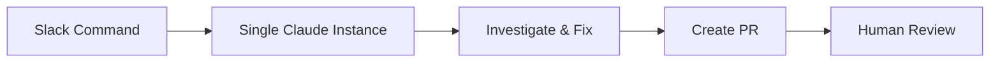
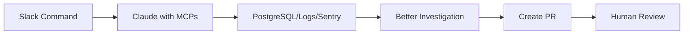
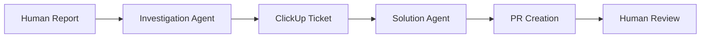
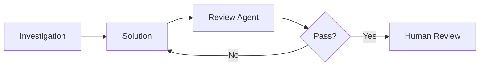
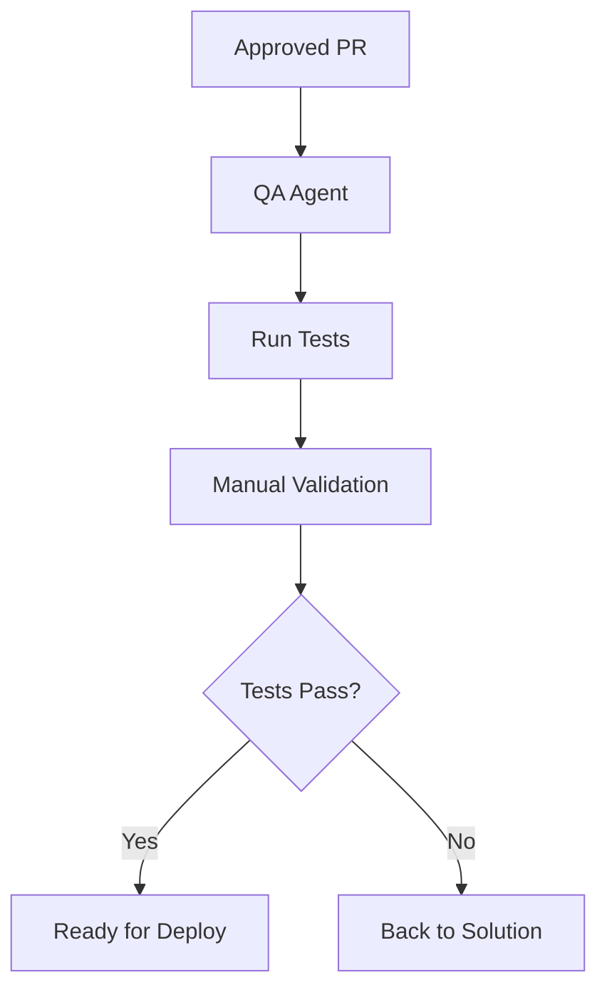

# Enhanced Bug Fixing MVP - Bridging Simple to Sophisticated

## Overview
This document outlines how to evolve from the simple MVP to the full multi-agent system, allowing you to start delivering value immediately while building toward the comprehensive solution.

## MVP Evolution Strategy

### Stage 1: Simple Manual Trigger (Week 1) ✅
**Goal**: Prove the core concept works



#### Quick Implementation
```typescript
// Minimal Slack command handler
app.command('/fix-bug', async ({ command, ack, client }) => {
  await ack();
  
  const claude = new Anthropic({ apiKey: process.env.ANTHROPIC_API_KEY });
  
  // Simple prompt with bug description
  const response = await claude.messages.create({
    model: 'claude-3-opus-20240229',
    messages: [{
      role: 'user',
      content: `Fix this bug: ${command.text}
      
      You have access to:
      - The codebase (via file reading)
      - Recent error logs
      - The ability to create a PR
      
      Please investigate and fix.`
    }]
  });
  
  // Create PR with fix
  await createSimplePR(response);
});
```

**Deliverables**:
- Basic Slack integration
- Simple PR creation
- Proof that Claude can fix real bugs

### Stage 2: Add MCP for Investigation (Week 2) 🚧
**Goal**: Improve investigation quality with real data



#### MCP Integration
```typescript
// Enhanced with MCP connections
const mcpServer = new MCPServer({
  tools: [
    postgresReadOnly,
    betterstackLogs,
    sentryErrors,
    clickupCreate
  ]
});

app.command('/fix-bug', async ({ command, ack }) => {
  await ack();
  
  // Claude now has access to production data
  const result = await claude.withMCP(mcpServer).investigate({
    description: command.text,
    tools: ['query_database', 'search_logs', 'get_errors']
  });
  
  // Automatically create ClickUp ticket
  const ticket = await createClickupTicket(result);
  
  // Generate fix with context
  const fix = await claude.generateFix(result);
  await createPR(fix, ticket);
});
```

**Deliverables**:
- MCP connections working
- ClickUp tickets created
- Richer investigation data

### Stage 3: Separate Investigation & Solution (Week 3) 📋
**Goal**: Improve fix quality by separating concerns



#### Agent Separation
```typescript
// Dedicated Investigation Agent
class InvestigationAgent {
  async investigate(bugReport: string): Promise<Investigation> {
    // Thorough investigation with all MCPs
    const data = await this.gatherAllData(bugReport);
    const analysis = await this.analyzeRootCause(data);
    const ticket = await this.createDetailedTicket(analysis);
    
    return { analysis, ticket, priority: this.prioritize(analysis) };
  }
}

// Dedicated Solution Agent  
class SolutionAgent {
  async createFix(investigation: Investigation): Promise<PR> {
    // Focused on code generation
    const strategy = await this.planFix(investigation);
    const implementation = await this.implement(strategy);
    return await this.createPR(implementation);
  }
}
```

**Deliverables**:
- Two specialized agents
- Better investigation reports
- More thoughtful fixes

### Stage 4: Add Automated Review (Week 4) 📋
**Goal**: Catch issues before human review



#### Review Loop
```typescript
// Add review iteration
class ReviewAgent {
  async reviewAndIterate(pr: PR, solutionAgent: SolutionAgent) {
    let approved = false;
    let iterations = 0;
    
    while (!approved && iterations < 3) {
      const review = await this.review(pr);
      
      if (review.approved) {
        approved = true;
      } else {
        pr = await solutionAgent.addressFeedback(review);
      }
      iterations++;
    }
    
    return pr;
  }
}
```

**Deliverables**:
- Automated code review
- Iterative improvements
- Higher quality PRs

### Stage 5: Basic QA Automation (Week 5) 📋
**Goal**: Validate fixes actually work



#### Simple QA
```typescript
// Start with basic test execution
class SimpleQAAgent {
  async validateFix(pr: PR): Promise<QAResult> {
    // Run existing tests
    const testResults = await this.runTests();
    
    // Basic UI testing if applicable
    if (pr.affectsUI) {
      const uiResults = await this.basicUITest(pr);
      testResults.ui = uiResults;
    }
    
    return {
      passed: testResults.allPassed,
      evidence: testResults.logs,
      confidence: this.calculateConfidence(testResults)
    };
  }
}
```

**Deliverables**:
- Automated test execution
- Basic validation
- QA reports

## Transition Plan

### Week-by-Week Rollout

#### Week 1: Launch Simple MVP
- Deploy basic Slack command
- Fix 5-10 simple bugs
- Measure time savings
- Gather feedback

#### Week 2: Add Data Access
- Connect MCPs incrementally
- Start with logs, then database
- Improve investigation quality
- Create first ClickUp tickets

#### Week 3: Split Agents
- Deploy investigation agent
- Deploy solution agent  
- Run in parallel with MVP
- Compare quality metrics

#### Week 4: Enable Review Loop
- Add review agent
- Test iteration capability
- Measure quality improvement
- Reduce human review time

#### Week 5: Basic QA
- Add test runner
- Simple validation
- Build confidence
- Prepare for full automation

### Metrics to Track

```yaml
# Track from Day 1
basic_metrics:
  bugs_attempted: 0
  bugs_fixed: 0
  fix_success_rate: 0%
  time_to_pr: "manual baseline: 4 hours"
  human_changes_required: 0
  
# Add with MCP (Week 2)
investigation_metrics:
  data_sources_used: 0
  root_cause_accuracy: 0%
  ticket_quality_score: 0/10
  
# Add with agents (Week 3)
agent_metrics:
  investigation_time: 0
  solution_time: 0
  total_time: 0
  
# Add with review (Week 4)
quality_metrics:
  review_iterations: 0
  auto_approval_rate: 0%
  code_quality_score: 0/10
  
# Add with QA (Week 5)
validation_metrics:
  test_pass_rate: 0%
  qa_confidence: 0%
  bugs_caught: 0
```

### Risk Mitigation by Stage

#### Stage 1 Risks (Minimal)
- **Risk**: Bad fix breaks something
- **Mitigation**: Human review required
- **Rollback**: Standard PR revert

#### Stage 2 Risks (Low)
- **Risk**: MCP queries impact production
- **Mitigation**: Read-only access, rate limits
- **Rollback**: Disable MCP, fall back to Stage 1

#### Stage 3 Risks (Medium)
- **Risk**: Agents get out of sync
- **Mitigation**: Shared context via ClickUp
- **Rollback**: Combine agents back to one

#### Stage 4 Risks (Medium)
- **Risk**: Infinite review loops
- **Mitigation**: Iteration limits, human escalation
- **Rollback**: Skip review, go to human

#### Stage 5 Risks (Higher)
- **Risk**: False positive QA results
- **Mitigation**: Human verification required
- **Rollback**: Manual QA only

## Decision Points

### When to Progress to Next Stage

#### Stage 1 → 2: Add MCPs
- ✅ Fixed 10+ bugs successfully
- ✅ Team comfortable with process
- ✅ MCP connections tested
- ✅ < 20% of fixes need major changes

#### Stage 2 → 3: Split Agents  
- ✅ ClickUp tickets providing value
- ✅ Investigation data improving fixes
- ✅ Clear separation of concerns
- ✅ Ready for more complexity

#### Stage 3 → 4: Add Review
- ✅ PRs still need human changes
- ✅ Code quality concerns
- ✅ Want faster iteration
- ✅ Review criteria defined

#### Stage 4 → 5: Add QA
- ✅ Fixes passing review
- ✅ Want deployment confidence  
- ✅ Test infrastructure ready
- ✅ QA scenarios defined

### When to Stop/Rollback

#### Red Flags
- 🚫 Fix success rate < 50%
- 🚫 Taking longer than manual
- 🚫 Team resistance high
- 🚫 Costs exceeding budget
- 🚫 Quality concerns rising

#### Green Flags  
- ✅ Consistent time savings
- ✅ Developers requesting more
- ✅ Quality improving
- ✅ Costs within budget
- ✅ Stakeholder satisfaction

## Implementation Shortcuts

### Quick Wins for Each Stage

#### Stage 1: Template Library
```typescript
// Pre-built fix templates
const FIX_TEMPLATES = {
  null_check: (varName: string) => 
    `if (!${varName}) { return handleError('${varName} is required'); }`,
    
  try_catch: (code: string) => 
    `try { ${code} } catch (error) { logger.error(error); throw new AppError(error); }`,
    
  validation: (field: string, type: string) =>
    `if (typeof ${field} !== '${type}') { throw new ValidationError('Invalid ${field}'); }`
};
```

#### Stage 2: MCP Query Library
```sql
-- Common investigation queries
-- Recent errors for user
SELECT * FROM errors 
WHERE user_id = $1 
AND created_at > NOW() - INTERVAL '24 hours'
ORDER BY created_at DESC;

-- Payment failure patterns
SELECT failure_reason, COUNT(*) 
FROM payment_attempts
WHERE status = 'failed'
AND created_at > NOW() - INTERVAL '7 days'
GROUP BY failure_reason;
```

#### Stage 3: Context Templates
```yaml
# Investigation template
investigation_context:
  bug_summary: ""
  affected_users: 0
  error_frequency: ""
  suspected_cause: ""
  related_code: []
  recent_changes: []
  
# Solution template  
solution_context:
  approach: ""
  files_to_change: []
  risks: []
  testing_needed: []
```

## Conclusion

This enhanced MVP approach allows you to:
1. **Start delivering value in Week 1** with simple bug fixes
2. **Build confidence incrementally** with each stage
3. **Maintain flexibility** to stop or rollback at any point
4. **Learn what works** before committing to full implementation
5. **Show progress** to stakeholders throughout

The key is starting simple and adding complexity only when the previous stage is stable and delivering value. Each stage is valuable on its own, so there's no pressure to complete all stages if earlier ones are sufficient for your needs.