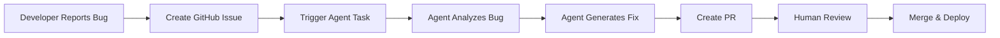

# Bug Fixing Agentic Workflow - MVP Design

## Overview
A minimal viable implementation of automated bug fixing that starts with manual bug discovery and focuses on proving the core value proposition before adding complexity.

## MVP Scope

### What's Included ✅
- Manual bug reporting via GitHub issue template
- Basic agent task to analyze and fix bugs
- Simple PR creation with fix
- Manual validation and merge

### What's NOT Included ❌
- Automated Sentry detection
- Complex root cause analysis
- Hotfix deployments
- Post-deployment monitoring
- Multiple agent types

## MVP Workflow



## Implementation Plan

### Phase 1: Basic Infrastructure (Week 1)

#### 1. GitHub Issue Template
```yaml
# .github/ISSUE_TEMPLATE/bug-fix-agent.yml
name: 🤖 Agent Bug Fix Request
description: Request automated bug fix from AI agent
title: "[Agent Fix]: "
labels: ["bug", "agent-fix"]
body:
  - type: textarea
    id: description
    attributes:
      label: Bug Description
      description: Clear description of the bug
      placeholder: "Users cannot withdraw funds, getting 500 error"
    validations:
      required: true
      
  - type: textarea
    id: reproduction
    attributes:
      label: Reproduction Steps
      description: How to reproduce the bug
      value: |
        1. Go to '...'
        2. Click on '...'
        3. See error
    validations:
      required: true
      
  - type: input
    id: error_location
    attributes:
      label: Error Location (if known)
      description: File path or error message
      placeholder: "src/modules/Payment/payment.service.ts:123"
      
  - type: dropdown
    id: severity
    attributes:
      label: Severity
      options:
        - Critical (users blocked)
        - High (feature broken)
        - Medium (degraded experience)
        - Low (minor issue)
    validations:
      required: true
```

#### 2. Simple GitHub Action Trigger
```yaml
# .github/workflows/agent-bug-fix-mvp.yml
name: Agent Bug Fix MVP
on:
  issues:
    types: [labeled]

jobs:
  fix-bug:
    if: contains(github.event.label.name, 'agent-fix')
    runs-on: ubuntu-latest
    steps:
      - name: Checkout
        uses: actions/checkout@v3
        
      - name: Setup Node
        uses: actions/setup-node@v3
        with:
          node-version: '18'
          
      - name: Run Agent Fix Script
        env:
          GITHUB_TOKEN: ${{ secrets.GITHUB_TOKEN }}
          ANTHROPIC_API_KEY: ${{ secrets.ANTHROPIC_API_KEY }}
          ISSUE_NUMBER: ${{ github.event.issue.number }}
        run: |
          npm install
          node scripts/agent-bug-fix.js
```

#### 3. Minimal Agent Script
```typescript
// scripts/agent-bug-fix.js
import { Anthropic } from '@anthropic-ai/sdk';
import { Octokit } from '@octokit/rest';
import { readFileSync, writeFileSync } from 'fs';
import { execSync } from 'child_process';

async function main() {
  const issueNumber = process.env.ISSUE_NUMBER;
  const github = new Octokit({ auth: process.env.GITHUB_TOKEN });
  const anthropic = new Anthropic({ apiKey: process.env.ANTHROPIC_API_KEY });
  
  // 1. Get issue details
  const { data: issue } = await github.issues.get({
    owner: 'blaze-xyz',
    repo: 'blaze-platform',
    issue_number: issueNumber
  });
  
  // 2. Parse bug information
  const bugInfo = parseBugInfo(issue.body);
  
  // 3. Create prompt for Claude
  const prompt = createBugFixPrompt(bugInfo);
  
  // 4. Get fix from Claude
  const response = await anthropic.messages.create({
    model: 'claude-3-opus-20240229',
    max_tokens: 4000,
    messages: [{
      role: 'user',
      content: prompt
    }]
  });
  
  // 5. Apply the fix
  const fix = parseClaudeResponse(response);
  applyFix(fix);
  
  // 6. Create PR
  const prUrl = await createPullRequest(fix, issue);
  
  // 7. Comment on issue
  await github.issues.createComment({
    owner: 'blaze-xyz',
    repo: 'blaze-platform',
    issue_number: issueNumber,
    body: `🤖 I've created a fix for this bug!\n\nPR: ${prUrl}\n\nPlease review and test the changes.`
  });
}

function parseBugInfo(issueBody) {
  // Simple parsing logic
  const lines = issueBody.split('\n');
  const bugInfo = {
    description: '',
    reproduction: '',
    errorLocation: '',
    severity: ''
  };
  
  // Extract sections from issue template
  let currentSection = '';
  for (const line of lines) {
    if (line.includes('Bug Description')) currentSection = 'description';
    else if (line.includes('Reproduction Steps')) currentSection = 'reproduction';
    else if (line.includes('Error Location')) currentSection = 'errorLocation';
    else if (line.includes('Severity')) currentSection = 'severity';
    else if (currentSection && line.trim()) {
      bugInfo[currentSection] += line + '\n';
    }
  }
  
  return bugInfo;
}

function createBugFixPrompt(bugInfo) {
  return `You are an expert developer fixing a bug in the Blaze platform.

Bug Information:
- Description: ${bugInfo.description}
- Reproduction Steps: ${bugInfo.reproduction}
- Error Location: ${bugInfo.errorLocation || 'Not specified'}
- Severity: ${bugInfo.severity}

Your task:
1. Identify the most likely cause of the bug
2. Generate a minimal fix that resolves the issue
3. Include appropriate error handling
4. Add a test to prevent regression

Please provide:
1. The file path that needs to be modified
2. The exact code changes (show before and after)
3. A brief explanation of the fix
4. A simple test case

Format your response as JSON:
{
  "files": [{
    "path": "src/...",
    "changes": {
      "before": "...",
      "after": "..."
    }
  }],
  "explanation": "...",
  "test": {
    "path": "src/...spec.ts",
    "code": "..."
  }
}`;
}

function applyFix(fix) {
  // Create a new branch
  const branchName = `fix/agent-${Date.now()}`;
  execSync(`git checkout -b ${branchName}`);
  
  // Apply file changes
  for (const file of fix.files) {
    const content = readFileSync(file.path, 'utf8');
    const updatedContent = content.replace(
      file.changes.before,
      file.changes.after
    );
    writeFileSync(file.path, updatedContent);
  }
  
  // Add test if provided
  if (fix.test) {
    writeFileSync(fix.test.path, fix.test.code);
  }
  
  // Commit changes
  execSync('git add .');
  execSync(`git commit -m "fix: ${fix.explanation}"`);
  execSync(`git push origin ${branchName}`);
  
  return branchName;
}

main().catch(console.error);
```

### Phase 2: Enhanced Analysis (Week 2)

#### 1. Better Context Gathering
```typescript
// Enhanced bug analysis with code context
async function gatherContext(bugInfo) {
  const context = {
    relatedFiles: [],
    recentChanges: [],
    similarBugs: []
  };
  
  // If error location is provided, read surrounding code
  if (bugInfo.errorLocation) {
    const [filePath, lineNumber] = bugInfo.errorLocation.split(':');
    const fileContent = readFileSync(filePath, 'utf8');
    const lines = fileContent.split('\n');
    
    // Get 20 lines of context
    const startLine = Math.max(0, parseInt(lineNumber) - 10);
    const endLine = Math.min(lines.length, parseInt(lineNumber) + 10);
    
    context.errorContext = {
      file: filePath,
      lines: lines.slice(startLine, endLine).join('\n'),
      lineNumber: parseInt(lineNumber)
    };
  }
  
  // Get recent git changes to the file
  if (bugInfo.errorLocation) {
    const gitLog = execSync(
      `git log -p -5 --follow ${bugInfo.errorLocation.split(':')[0]}`
    ).toString();
    context.recentChanges = gitLog;
  }
  
  return context;
}
```

#### 2. Validation Before PR
```typescript
// Run basic validation before creating PR
async function validateFix(fix, bugInfo) {
  const validations = {
    testsPass: false,
    lintingPass: false,
    buildPass: false
  };
  
  try {
    // Run tests
    execSync('npm test -- --testPathPattern=' + fix.test.path);
    validations.testsPass = true;
  } catch (e) {
    console.error('Tests failed:', e);
  }
  
  try {
    // Run linting
    execSync('npm run lint');
    validations.lintingPass = true;
  } catch (e) {
    console.error('Linting failed:', e);
  }
  
  try {
    // Run build
    execSync('npm run build');
    validations.buildPass = true;
  } catch (e) {
    console.error('Build failed:', e);
  }
  
  return validations;
}
```

### Phase 3: Simple UI (Week 3)

#### 1. Slack Integration for Easy Reporting
```typescript
// Slack slash command: /fix-bug
app.command('/fix-bug', async ({ command, ack, client }) => {
  await ack();
  
  // Open modal for bug details
  await client.views.open({
    trigger_id: command.trigger_id,
    view: {
      type: 'modal',
      title: { type: 'plain_text', text: 'Report Bug for Agent Fix' },
      submit: { type: 'plain_text', text: 'Submit' },
      blocks: [
        {
          type: 'input',
          label: { type: 'plain_text', text: 'Bug Description' },
          element: {
            type: 'plain_text_input',
            multiline: true,
            action_id: 'description'
          }
        },
        {
          type: 'input',
          label: { type: 'plain_text', text: 'Error Location (optional)' },
          element: {
            type: 'plain_text_input',
            action_id: 'location',
            placeholder: { 
              type: 'plain_text', 
              text: 'e.g., payment.service.ts:123' 
            }
          },
          optional: true
        }
      ]
    }
  });
});
```

#### 2. Simple Dashboard
```html
<!-- Simple web dashboard for bug fix status -->
<!DOCTYPE html>
<html>
<head>
  <title>Agent Bug Fixes</title>
  <style>
    .bug-card {
      border: 1px solid #ddd;
      padding: 15px;
      margin: 10px;
      border-radius: 5px;
    }
    .status { 
      padding: 5px 10px; 
      border-radius: 3px; 
      font-size: 12px;
    }
    .pending { background: #ffc107; }
    .in-progress { background: #17a2b8; }
    .completed { background: #28a745; }
    .failed { background: #dc3545; }
  </style>
</head>
<body>
  <h1>Agent Bug Fix Dashboard</h1>
  <div id="bugs"></div>
  
  <script>
    async function loadBugs() {
      const response = await fetch('/api/agent-bugs');
      const bugs = await response.json();
      
      const container = document.getElementById('bugs');
      container.innerHTML = bugs.map(bug => `
        <div class="bug-card">
          <h3>${bug.title}</h3>
          <p>${bug.description}</p>
          <span class="status ${bug.status}">${bug.status}</span>
          ${bug.prUrl ? `<a href="${bug.prUrl}">View PR</a>` : ''}
        </div>
      `).join('');
    }
    
    loadBugs();
    setInterval(loadBugs, 10000); // Refresh every 10 seconds
  </script>
</body>
</html>
```

## Success Metrics for MVP

### Quantitative Metrics
1. **Fix Success Rate**: % of bugs successfully fixed by agent
   - Target: 60% for simple bugs
   - Measure: PRs created / Issues labeled

2. **Time to Fix**: From issue creation to PR
   - Target: < 30 minutes
   - Current baseline: 2-4 hours manual

3. **PR Approval Rate**: % of agent PRs approved without major changes
   - Target: 70%
   - Measure: Approved PRs / Total PRs

4. **Test Coverage**: % of fixes that include tests
   - Target: 100%
   - Measure: PRs with tests / Total PRs

### Qualitative Metrics
1. **Developer Satisfaction**: Survey on ease of use
2. **Code Quality**: Review scores from CodeRabbit
3. **Fix Completeness**: Does it actually resolve the issue?

## MVP Limitations & Next Steps

### Current Limitations
1. Only handles simple, well-defined bugs
2. Requires manual bug reporting
3. No automatic severity assessment
4. Limited context awareness
5. No learning from previous fixes

### Next Steps After MVP Success
1. **Week 4-5**: Add Sentry integration for auto-detection
2. **Week 6**: Implement pattern matching for similar bugs
3. **Week 7**: Add hotfix deployment capability
4. **Week 8**: Machine learning for better fix suggestions

## Quick Start Guide

### 1. Setup (30 minutes)
```bash
# Add GitHub secrets
gh secret set ANTHROPIC_API_KEY
gh secret set GITHUB_TOKEN

# Add issue template
cp bug-fix-agent.yml .github/ISSUE_TEMPLATE/

# Add workflow
cp agent-bug-fix-mvp.yml .github/workflows/

# Install dependencies
npm install @anthropic-ai/sdk @octokit/rest
```

### 2. First Bug Fix
1. Create issue using "Agent Bug Fix Request" template
2. Add `agent-fix` label
3. Watch the magic happen
4. Review and merge PR

### 3. Monitor Results
- Check GitHub Actions for execution logs
- Review PR quality
- Track metrics in simple spreadsheet

## Cost Estimate

### MVP Costs (Monthly)
- **Claude API**: ~$50 (assuming 100 bug fixes)
- **GitHub Actions**: Free (included in plan)
- **Development Time**: 3 weeks × 1 developer
- **Total**: ~$50/month + development cost

### ROI Calculation
- **Time Saved**: 2 hours/bug × 100 bugs = 200 hours/month
- **Developer Cost**: $100/hour × 200 hours = $20,000
- **Net Savings**: $19,950/month

## Risk Mitigation

### Technical Risks
1. **Bad fixes break production**
   - Mitigation: Always require human review
   - All changes go through normal CI/CD

2. **Agent misunderstands bug**
   - Mitigation: Clear issue templates
   - Human can always close PR

3. **Sensitive code exposure**
   - Mitigation: Limit file access
   - No production secrets in code

### Process Risks
1. **Developer resistance**
   - Mitigation: Start with volunteers
   - Show clear time savings

2. **Over-reliance on automation**
   - Mitigation: Education on limitations
   - Clear guidelines on what bugs to submit

This MVP approach allows you to:
- Start testing within days, not weeks
- Prove value with minimal investment
- Learn what works before scaling
- Build developer confidence gradually

Would you like me to help you implement any specific part of this MVP?