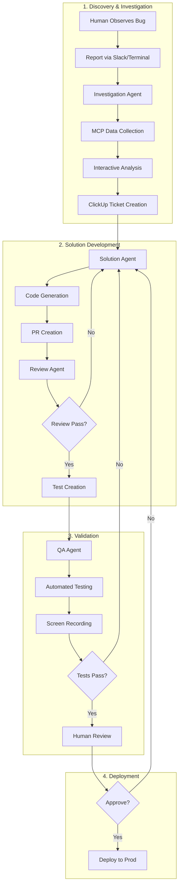

# Product Requirements Document: Multi-Agent Bug Fixing Workflow

## Executive Summary

### Vision
Create an intelligent, multi-agent system that autonomously investigates, fixes, and validates bugs from initial human observation through to production deployment, requiring human intervention only for final approval.

### Goals
- Reduce bug resolution time from days to hours
- Improve bug investigation quality through systematic analysis
- Ensure comprehensive testing before deployment
- Free developers to focus on feature development

### Success Metrics
- 80% of bugs resolved without human code changes
- 90% reduction in time from report to fix
- 100% test coverage for all fixes
- Zero regression rate for agent-fixed bugs

## System Architecture



## Detailed Component Specifications

### 1. Investigation Agent

#### Purpose
Systematically investigate reported bugs using all available data sources to create comprehensive bug reports and prioritize issues.

#### Entry Points
```yaml
slack_command:
  trigger: "@claude /bug-report"
  interface: Interactive Slack modal
  
terminal_command:
  trigger: "rclaude /bug-report"
  interface: Terminal UI with prompts
```

#### MCP Integrations
```typescript
interface MCPConnections {
  postgres: {
    type: "read-only";
    database: "production";
    permissions: ["SELECT"];
    use_cases: [
      "Query user data related to bug",
      "Check data integrity",
      "Analyze patterns"
    ];
  };
  
  betterstack: {
    type: "logs";
    timeframe: "last_24_hours";
    use_cases: [
      "Find error patterns",
      "Trace request flow",
      "Identify error frequency"
    ];
  };
  
  sentry: {
    type: "errors_and_sessions";
    features: [
      "Stack traces",
      "User context",
      "Breadcrumbs",
      "Session replays"
    ];
  };
  
  posthog: {
    type: "analytics";
    features: [
      "Screen recordings",
      "User paths",
      "Feature usage"
    ];
  };
  
  clickup: {
    type: "write";
    permissions: ["create_task", "update_task"];
    list: "Squash Bugs";
  };
}
```

#### Investigation Flow
```typescript
class InvestigationAgent {
  async investigate(bugReport: BugReport): Promise<Investigation> {
    // 1. Initial triage
    const context = await this.gatherInitialContext(bugReport);
    
    // 2. Interactive clarification with reporter
    const clarifications = await this.interactiveClarification(context);
    
    // 3. Deep data gathering
    const data = await Promise.all([
      this.queryDatabase(context),
      this.searchLogs(context),
      this.analyzeErrors(context),
      this.findScreenRecordings(context)
    ]);
    
    // 4. Root cause analysis
    const analysis = await this.analyzeRootCause(data);
    
    // 5. Create comprehensive report
    return this.createInvestigationReport(analysis);
  }
  
  async prioritize(investigation: Investigation): Priority {
    // Automated prioritization based on:
    // - User impact (how many affected)
    // - Business impact (revenue, critical features)
    // - Frequency (how often occurring)
    // - Severity (data loss, security, etc.)
    
    const score = this.calculatePriorityScore(investigation);
    
    if (score > 90) return Priority.URGENT;
    if (score > 70) return Priority.HIGH;
    if (score > 40) return Priority.NORMAL;
    return Priority.LOW;
  }
}
```

#### ClickUp Ticket Template
```yaml
title: "[BUG] {{ summary }}"
description: |
  ## Bug Report
  **Reported by**: {{ reporter }}
  **First observed**: {{ timestamp }}
  **Priority**: {{ priority }}
  
  ## Description
  {{ detailed_description }}
  
  ## Impact
  - **Users affected**: {{ user_count }}
  - **Frequency**: {{ occurrence_rate }}
  - **Business impact**: {{ business_impact }}
  
  ## Investigation Results
  ### Error Analysis
  {{ error_summary }}
  
  ### Database Findings
  {{ db_findings }}
  
  ### Log Analysis
  {{ log_patterns }}
  
  ### Screen Recordings
  {{ recording_links }}
  
  ## Root Cause
  {{ root_cause_analysis }}
  
  ## Proposed Solution
  {{ solution_approach }}
  
  ## Reproduction Steps
  {{ reproduction_steps }}
  
custom_fields:
  agent_confidence: {{ confidence_score }}
  estimated_fix_time: {{ estimate }}
  affected_services: {{ services }}
  
attachments:
  - error_traces.json
  - relevant_logs.txt
  - screen_recordings.mp4
```

### 2. Solution Agent

#### Purpose
Generate code fixes based on investigation findings, creating PRs with comprehensive solutions.

#### Capabilities
```typescript
class SolutionAgent {
  constructor(
    private codebase: CodebaseAccess,
    private investigation: Investigation,
    private llm: AnthropicClient
  ) {}
  
  async generateSolution(): Promise<Solution> {
    // 1. Analyze codebase context
    const codeContext = await this.analyzeCodebase();
    
    // 2. Generate fix strategy
    const strategy = await this.planFix(codeContext);
    
    // 3. Create branches for different approaches
    const branches = await this.createBranches(strategy);
    
    // 4. Implement fixes
    const implementations = await Promise.all(
      branches.map(branch => this.implementFix(branch))
    );
    
    // 5. Create PRs
    const prs = await this.createPullRequests(implementations);
    
    // 6. Update ClickUp ticket
    await this.updateTicket(prs);
    
    return { prs, implementations };
  }
  
  private async implementFix(branch: Branch): Promise<Implementation> {
    // Generate minimal, targeted fixes
    // Include defensive programming
    // Add appropriate error handling
    // Follow existing code patterns
  }
}
```

#### PR Template
```markdown
## 🤖 Automated Bug Fix

**ClickUp Ticket**: [#{{ ticket_id }}]({{ ticket_url }})
**Bug Summary**: {{ bug_summary }}
**Priority**: {{ priority }}

### Changes Made
{{ change_summary }}

### Files Modified
{{ file_list_with_descriptions }}

### Fix Approach
{{ detailed_explanation }}

### Testing
- [ ] Unit tests added
- [ ] Integration tests added
- [ ] Manual testing completed
- [ ] No regressions identified

### Verification Steps
{{ how_to_verify }}

### Risk Assessment
**Risk Level**: {{ risk_level }}
**Mitigation**: {{ mitigation_steps }}

---
*Generated by Solution Agent v1.0*
```

### 3. Review Agent

#### Purpose
Conduct thorough code reviews using established standards and engage in iterative improvements with the Solution Agent.

#### Review Process
```typescript
class ReviewAgent {
  async reviewPR(pr: PullRequest): Promise<ReviewResult> {
    const reviews = await Promise.all([
      this.checkCodeStandards(pr),
      this.analyzeSecurityIssues(pr),
      this.validateBusinessLogic(pr),
      this.checkTestCoverage(pr),
      this.assessPerformanceImpact(pr)
    ]);
    
    return this.synthesizeReview(reviews);
  }
  
  async iterativeReview(
    pr: PullRequest,
    solutionAgent: SolutionAgent
  ): Promise<ApprovedPR> {
    let iteration = 0;
    let approved = false;
    
    while (!approved && iteration < 5) {
      const review = await this.reviewPR(pr);
      
      if (review.approved) {
        approved = true;
      } else {
        // Send feedback to solution agent
        const updates = await solutionAgent.addressFeedback(review);
        pr = await this.updatePR(pr, updates);
      }
      
      iteration++;
    }
    
    if (!approved) {
      throw new Error('Unable to automatically resolve review issues');
    }
    
    return pr as ApprovedPR;
  }
}
```

#### Review Criteria
```yaml
code_quality:
  - naming_conventions
  - code_organization
  - dry_principles
  - readability
  
security:
  - input_validation
  - authentication_checks
  - data_exposure
  - injection_vulnerabilities
  
performance:
  - query_optimization
  - memory_usage
  - algorithm_efficiency
  - caching_opportunities
  
testing:
  - coverage_threshold: 80%
  - edge_cases_covered
  - error_scenarios_tested
  - integration_points_verified
```

### 4. QA Agent

#### Purpose
Perform automated testing using simulators and browsers, capturing evidence of fix effectiveness.

#### Testing Infrastructure
```typescript
interface QAInfrastructure {
  simulators: {
    ios: IOSSimulator[];
    android: AndroidEmulator[];
  };
  browsers: {
    chrome: ChromeDriver;
    firefox: FirefoxDriver;
    safari: SafariDriver;
  };
  recording: {
    video: ScreenRecorder;
    screenshots: ScreenshotCapture;
    logs: LogCapture;
  };
}

class QAAgent {
  async performQA(pr: ApprovedPR): Promise<QAResult> {
    // 1. Set up test environment
    const env = await this.setupTestEnvironment(pr);
    
    // 2. Run automated tests
    const testResults = await this.runAutomatedTests(env);
    
    // 3. Perform manual test scenarios
    const manualResults = await this.performManualScenarios(env);
    
    // 4. Capture evidence
    const evidence = await this.captureEvidence(manualResults);
    
    // 5. Generate QA report
    return this.generateQAReport(testResults, manualResults, evidence);
  }
  
  private async performManualScenarios(env: TestEnvironment) {
    const scenarios = this.generateTestScenarios(env.bugContext);
    
    for (const scenario of scenarios) {
      await this.startRecording();
      
      try {
        // Execute test steps
        await this.executeScenario(scenario);
        
        // Verify fix
        await this.verifyBugFixed(scenario);
        
        // Check for regressions
        await this.checkRegressions(scenario);
        
      } finally {
        await this.stopRecording();
      }
    }
  }
}
```

#### QA Report Template
```yaml
qa_report:
  summary:
    status: PASS/FAIL
    confidence: 95%
    test_coverage: 100%
    
  automated_tests:
    unit_tests:
      passed: 45
      failed: 0
      skipped: 2
    integration_tests:
      passed: 12
      failed: 0
    e2e_tests:
      passed: 5
      failed: 0
      
  manual_validation:
    scenarios_tested: 8
    scenarios_passed: 8
    issues_found: []
    
  evidence:
    recordings:
      - bug_reproduction_before_fix.mp4
      - bug_fixed_after_change.mp4
      - regression_test_suite.mp4
    screenshots:
      - error_state_before.png
      - success_state_after.png
    logs:
      - test_execution.log
      - app_behavior.log
      
  recommendations:
    deploy_confidence: HIGH
    additional_testing: []
    monitoring_suggestions: []
```

### 5. Human Handoff

#### Decision Points
```typescript
interface HumanDecisionPoint {
  stage: 'post_qa' | 'high_risk' | 'low_confidence';
  context: {
    ticket: ClickUpTicket;
    investigation: Investigation;
    solution: Solution;
    reviews: Review[];
    qaResults: QAResult;
  };
  actions: ['approve', 'reject', 'request_changes'];
}
```

#### Handoff Interface
```typescript
class HumanHandoff {
  async requestApproval(context: HumanDecisionPoint): Promise<Decision> {
    // 1. Send comprehensive summary to Slack
    await this.notifySlack({
      channel: '#eng-bug-fixes',
      message: this.generateSummary(context),
      actions: [
        { text: 'Approve', value: 'approve', style: 'primary' },
        { text: 'Request Changes', value: 'changes', style: 'warning' },
        { text: 'Reject', value: 'reject', style: 'danger' }
      ]
    });
    
    // 2. Update ClickUp ticket
    await this.updateTicketStatus(context.ticket, 'Awaiting Approval');
    
    // 3. Wait for decision
    return await this.waitForDecision();
  }
}
```

## Implementation Phases

### Phase 1: Investigation Agent (Weeks 1-2)
- [ ] Set up MCP connections
- [ ] Build investigation logic
- [ ] Create ClickUp integration
- [ ] Implement prioritization algorithm
- [ ] Deploy Slack and terminal interfaces

### Phase 2: Solution Agent (Weeks 3-4)
- [ ] Build code analysis capabilities
- [ ] Implement fix generation
- [ ] Create PR automation
- [ ] Add branch management
- [ ] Connect to investigation output

### Phase 3: Review Agent (Week 5)
- [ ] Implement review criteria
- [ ] Build feedback loop with Solution Agent
- [ ] Create review reports
- [ ] Add iterative improvement logic

### Phase 4: QA Agent (Weeks 6-7)
- [ ] Set up testing infrastructure
- [ ] Implement simulator control
- [ ] Add screen recording
- [ ] Build test scenario generation
- [ ] Create QA reports

### Phase 5: Integration & Optimization (Week 8)
- [ ] Connect all agents
- [ ] Implement handoff points
- [ ] Add monitoring and metrics
- [ ] Performance optimization
- [ ] Documentation and training

## Technical Requirements

### Infrastructure
```yaml
compute:
  investigation_agent:
    type: serverless
    memory: 2GB
    timeout: 5min
    
  solution_agent:
    type: container
    memory: 8GB
    gpu: optional
    timeout: 30min
    
  review_agent:
    type: serverless
    memory: 4GB
    timeout: 15min
    
  qa_agent:
    type: dedicated
    memory: 16GB
    simulators: 4
    timeout: 60min
```

### Security & Compliance
```yaml
security:
  data_access:
    - read_only_production_db
    - no_pii_exposure
    - audit_all_queries
    
  code_access:
    - repository_read_write
    - branch_protection_rules
    - no_direct_main_push
    
  secrets:
    - vault_integration
    - no_hardcoded_credentials
    - rotate_api_keys_monthly
```

## Success Metrics

### Quantitative KPIs
```yaml
efficiency:
  time_to_fix:
    baseline: 2-3 days
    target: 2-4 hours
    measurement: ticket_created_to_merged
    
  fix_success_rate:
    baseline: N/A
    target: 80%
    measurement: successful_fixes / total_attempts
    
  human_intervention:
    baseline: 100%
    target: 20%
    measurement: human_touches / total_bugs

quality:
  test_coverage:
    baseline: 60%
    target: 90%
    measurement: lines_covered / total_lines
    
  regression_rate:
    baseline: 5%
    target: 0%
    measurement: regressions / total_fixes
    
  code_review_score:
    baseline: 7/10
    target: 9/10
    measurement: coderabbit_score

cost:
  developer_hours_saved:
    baseline: 0
    target: 160 hours/month
    measurement: bugs_fixed * avg_time_saved
    
  operational_cost:
    baseline: $0
    target: < $2000/month
    measurement: compute + api_costs
```

### Qualitative Goals
- Developer satisfaction with bug fix quality
- Reduced context switching for engineers
- Improved bug investigation documentation
- Better understanding of system failures
- Increased confidence in automated fixes

## Risk Management

### Technical Risks
```yaml
high_severity_bugs:
  risk: Agent makes critical system worse
  mitigation:
    - Extensive testing before merge
    - Human approval for high-risk changes
    - Automated rollback capabilities
    - Gradual rollout with monitoring

data_corruption:
  risk: Fix causes data integrity issues
  mitigation:
    - Read-only database access
    - Comprehensive data validation
    - Backup before deployment
    - Data integrity checks post-deploy

security_vulnerabilities:
  risk: Fix introduces security holes
  mitigation:
    - Security-focused review criteria
    - Automated security scanning
    - Limited permissions for agents
    - Human review for auth changes
```

### Operational Risks
```yaml
over_reliance:
  risk: Team loses debugging skills
  mitigation:
    - Require human investigation periodically
    - Document agent decision process
    - Training on agent limitations
    - Regular manual bug fixes

cost_overrun:
  risk: API and compute costs exceed budget
  mitigation:
    - Cost monitoring and alerts
    - Rate limiting on agents
    - Batch processing where possible
    - Regular cost optimization

false_confidence:
  risk: Trusting incorrect fixes
  mitigation:
    - Comprehensive QA process
    - Human verification required
    - Monitoring post-deployment
    - Quick rollback procedures
```

## Future Enhancements

### Version 2.0
- Learning from previous fixes
- Predictive bug detection
- Automatic deployment to production
- Multi-bug fix coordination
- Performance optimization suggestions

### Version 3.0
- Proactive bug prevention
- Architecture improvement suggestions
- Cross-service debugging
- Natural language bug reports from users
- Self-improving agent algorithms

## Conclusion

This multi-agent bug fixing system represents a significant leap in development efficiency, allowing teams to focus on feature development while maintaining high code quality. The phased approach ensures we can validate each component before full integration, minimizing risk while maximizing learning opportunities.