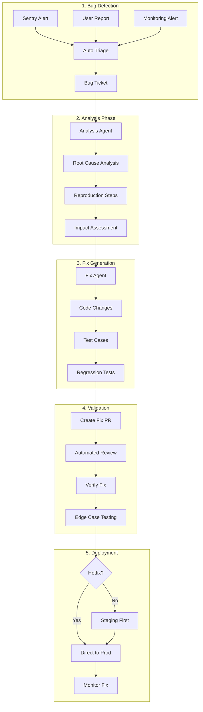

# Agentic Bug Fixing Workflow

## Overview
This document outlines the automated workflow for fixing bugs using AI agents, integrated with our existing monitoring, ticketing, and deployment infrastructure.

## Workflow Architecture



## Detailed Phase Descriptions

### 1. Bug Detection & Triage

#### Automated Bug Detection Sources
```typescript
interface BugSource {
  type: 'sentry' | 'user_report' | 'monitoring' | 'test_failure';
  severity: 'critical' | 'high' | 'medium' | 'low';
  metadata: Record<string, any>;
}

// Sentry Integration
export class SentryBugDetector {
  async processSentryAlert(alert: SentryAlert): Promise<BugTicket> {
    return {
      title: this.generateTitle(alert),
      description: this.extractDescription(alert),
      severity: this.calculateSeverity(alert),
      stackTrace: alert.stackTrace,
      affectedUsers: alert.userCount,
      frequency: alert.eventCount,
      firstSeen: alert.firstSeen,
      lastSeen: alert.lastSeen,
      tags: this.extractTags(alert)
    };
  }
}
```

#### Severity Classification
```yaml
severity_rules:
  critical:
    - payment_failure: true
    - data_loss: true
    - security_breach: true
    - complete_outage: true
    - affects_users: "> 10%"
    
  high:
    - partial_outage: true
    - major_feature_broken: true
    - affects_users: "> 1%"
    - revenue_impact: true
    
  medium:
    - minor_feature_broken: true
    - performance_degradation: "> 50%"
    - affects_users: "> 0.1%"
    
  low:
    - ui_glitch: true
    - non_blocking_error: true
    - affects_users: "< 0.1%"
```

#### Auto-Triage System
```typescript
export class BugTriageSystem {
  async triage(bug: BugReport): Promise<TriageResult> {
    // 1. Deduplicate
    const existingBug = await this.findSimilar(bug);
    if (existingBug) {
      return this.updateExisting(existingBug, bug);
    }
    
    // 2. Classify
    const classification = await this.classify(bug);
    
    // 3. Assign priority
    const priority = this.calculatePriority({
      severity: classification.severity,
      userImpact: classification.affectedUsers,
      businessImpact: classification.revenueImpact,
      regressionRisk: classification.isRegression
    });
    
    // 4. Create ticket
    return await this.createTicket({
      ...bug,
      classification,
      priority,
      assignee: this.selectAgent(classification)
    });
  }
}
```

### 2. Analysis Phase

#### Root Cause Analysis Agent
```typescript
interface AnalysisAgentConfig {
  bug: BugTicket;
  codebaseAccess: {
    readFiles: true;
    gitHistory: true;
    deploymentLogs: true;
    monitoringData: true;
  };
  tools: [
    'stack_trace_analyzer',
    'git_blame',
    'deployment_timeline',
    'code_search',
    'log_search'
  ];
}

export class RootCauseAnalyzer {
  async analyze(config: AnalysisAgentConfig): Promise<RootCauseReport> {
    // 1. Stack trace analysis
    const stackAnalysis = await this.analyzeStackTrace(
      config.bug.stackTrace
    );
    
    // 2. Recent changes correlation
    const recentChanges = await this.correlateWithChanges({
      files: stackAnalysis.affectedFiles,
      timeframe: config.bug.firstSeen,
      deployments: await this.getRecentDeployments()
    });
    
    // 3. Pattern matching
    const patterns = await this.matchKnownPatterns(config.bug);
    
    // 4. Generate reproduction steps
    const reproSteps = await this.generateReproSteps({
      stackTrace: stackAnalysis,
      userActions: config.bug.userActions,
      systemState: config.bug.systemState
    });
    
    return {
      rootCause: this.synthesize(stackAnalysis, recentChanges, patterns),
      reproductionSteps: reproSteps,
      affectedCode: stackAnalysis.affectedFiles,
      suspectedCommit: recentChanges.mostLikely,
      confidence: this.calculateConfidence()
    };
  }
}
```

#### Reproduction Step Generator
```yaml
reproduction_template:
  environment:
    - type: "{{ environment_type }}"
    - user_role: "{{ affected_user_role }}"
    - feature_flags: "{{ active_feature_flags }}"
    
  preconditions:
    - database_state: "{{ required_data }}"
    - user_state: "{{ user_conditions }}"
    
  steps:
    - action: "{{ user_action }}"
      expected: "{{ expected_result }}"
      actual: "{{ actual_result }}"
      
  verification:
    - check_logs: "{{ log_pattern }}"
    - check_database: "{{ db_query }}"
    - check_metrics: "{{ metric_spike }}"
```

#### Impact Assessment
```typescript
export class ImpactAssessor {
  async assess(bug: BugTicket): Promise<ImpactReport> {
    const [
      userImpact,
      systemImpact,
      businessImpact,
      securityImpact
    ] = await Promise.all([
      this.assessUserImpact(bug),
      this.assessSystemImpact(bug),
      this.assessBusinessImpact(bug),
      this.assessSecurityImpact(bug)
    ]);
    
    return {
      users: {
        affected: userImpact.count,
        percentage: userImpact.percentage,
        segments: userImpact.segments,
        severity: userImpact.severity
      },
      system: {
        components: systemImpact.components,
        performance: systemImpact.degradation,
        availability: systemImpact.availability
      },
      business: {
        revenue: businessImpact.revenueLoss,
        reputation: businessImpact.reputationRisk,
        compliance: businessImpact.complianceIssues
      },
      security: {
        dataExposure: securityImpact.dataRisk,
        vulnerabilities: securityImpact.vulnerabilities
      },
      priority: this.calculatePriority()
    };
  }
}
```

### 3. Fix Generation Phase

#### Fix Agent Configuration
```yaml
fix_agent_config:
  type: claude-code
  mode: bug_fix
  context:
    - bug_report: "{{ bug_ticket }}"
    - root_cause: "{{ root_cause_analysis }}"
    - affected_files: "{{ affected_code }}"
    - test_failures: "{{ failing_tests }}"
    - reproduction_steps: "{{ repro_steps }}"
    
  constraints:
    - minimal_changes: true
    - preserve_functionality: true
    - add_regression_tests: true
    - maintain_performance: true
    
  validation:
    - fix_resolves_issue: true
    - no_new_bugs: true
    - tests_pass: true
    - performance_maintained: true
```

#### Fix Generation Strategy
```typescript
export class BugFixGenerator {
  async generateFix(analysis: RootCauseReport): Promise<FixProposal> {
    // 1. Identify fix location
    const fixLocations = this.identifyFixLocations(analysis);
    
    // 2. Generate minimal fix
    const fixes = await Promise.all(
      fixLocations.map(location => 
        this.generateMinimalFix(location, analysis)
      )
    );
    
    // 3. Add defensive code
    const defensiveChanges = this.addDefensiveCode(fixes);
    
    // 4. Generate tests
    const tests = await this.generateTests({
      bugScenario: analysis.reproductionSteps,
      edgeCases: this.identifyEdgeCases(analysis),
      regressionPrevention: true
    });
    
    return {
      codeChanges: [...fixes, ...defensiveChanges],
      tests: tests,
      validation: this.generateValidation(analysis)
    };
  }
  
  private generateMinimalFix(
    location: CodeLocation,
    analysis: RootCauseReport
  ): Fix {
    // Strategy: Make smallest possible change
    return {
      file: location.file,
      changes: this.minimizeChanges(location, analysis),
      justification: this.explainFix(location, analysis)
    };
  }
}
```

#### Test Generation
```typescript
export class BugTestGenerator {
  async generateTests(bug: BugTicket, fix: FixProposal): Promise<TestSuite> {
    return {
      // Direct reproduction test
      reproductionTest: this.generateReproTest(bug),
      
      // Edge case tests
      edgeCaseTests: this.generateEdgeCaseTests(bug, fix),
      
      // Regression prevention
      regressionTests: this.generateRegressionTests(fix),
      
      // Integration tests
      integrationTests: this.generateIntegrationTests(bug),
      
      // Performance tests
      performanceTests: this.generatePerformanceTests(fix)
    };
  }
  
  private generateReproTest(bug: BugTicket): TestCase {
    return {
      name: `Bug ${bug.id}: ${bug.title}`,
      setup: bug.reproductionSteps.preconditions,
      steps: bug.reproductionSteps.steps,
      assertions: [
        // Should not throw the original error
        `expect(() => ${bug.failingCode}).not.toThrow()`,
        // Should produce expected result
        `expect(result).toBe(${bug.expectedResult})`
      ]
    };
  }
}
```

### 4. Validation Phase

#### Automated Validation Pipeline
```yaml
validation_pipeline:
  stages:
    - name: syntax_check
      timeout: 1m
      required: true
      
    - name: unit_tests
      timeout: 5m
      required: true
      coverage_threshold: 80%
      
    - name: integration_tests
      timeout: 15m
      required: true
      
    - name: reproduction_test
      timeout: 5m
      required: true
      verify: bug_no_longer_reproduces
      
    - name: regression_tests
      timeout: 10m
      required: true
      
    - name: performance_tests
      timeout: 10m
      required: false
      threshold: "within 5% of baseline"
      
    - name: security_scan
      timeout: 5m
      required: true
      
    - name: edge_case_fuzzing
      timeout: 20m
      required: false
```

#### Fix Verification
```typescript
export class FixVerifier {
  async verify(
    bug: BugTicket,
    fix: FixProposal,
    pr: PullRequest
  ): Promise<VerificationResult> {
    // 1. Deploy to isolated environment
    const testEnv = await this.deployTestEnvironment(pr);
    
    // 2. Run reproduction steps
    const reproResult = await this.runReproSteps(
      testEnv,
      bug.reproductionSteps
    );
    
    // 3. Verify fix effectiveness
    if (!reproResult.fixed) {
      return {
        status: 'failed',
        reason: 'Bug still reproduces',
        details: reproResult
      };
    }
    
    // 4. Check for side effects
    const sideEffects = await this.checkSideEffects(testEnv, fix);
    
    // 5. Performance validation
    const perfResult = await this.validatePerformance(testEnv);
    
    return {
      status: 'passed',
      bugFixed: true,
      sideEffects: sideEffects,
      performance: perfResult,
      recommendation: this.generateRecommendation()
    };
  }
}
```

### 5. Deployment Phase

#### Hotfix Decision Tree
```typescript
export class HotfixDecider {
  shouldHotfix(bug: BugTicket, impact: ImpactReport): boolean {
    // Critical bugs always hotfix
    if (bug.severity === 'critical') return true;
    
    // High severity with significant user impact
    if (bug.severity === 'high' && impact.users.percentage > 5) {
      return true;
    }
    
    // Security vulnerabilities
    if (impact.security.dataExposure || impact.security.vulnerabilities.length > 0) {
      return true;
    }
    
    // Revenue impact
    if (impact.business.revenue > 10000) return true;
    
    // Everything else goes through normal release
    return false;
  }
}
```

#### Deployment Strategy
```yaml
deployment_strategies:
  hotfix:
    steps:
      - name: emergency_approval
        approvers: ["oncall-engineer", "team-lead"]
        timeout: 30m
        
      - name: production_deploy
        strategy: blue_green
        rollback_on_error: true
        
      - name: smoke_tests
        tests: ["critical_paths", "payment_flow"]
        
      - name: monitor
        duration: 30m
        metrics: ["error_rate", "latency", "success_rate"]
        
  normal:
    steps:
      - name: staging_deploy
        automatic: true
        
      - name: staging_validation
        duration: 2h
        
      - name: canary_deploy
        percentage: 5
        duration: 1h
        
      - name: progressive_rollout
        stages: [5, 25, 50, 100]
        duration_per_stage: 1h
```

#### Post-Deploy Monitoring
```typescript
export class PostDeployMonitor {
  async monitor(
    deployment: Deployment,
    bug: BugTicket
  ): Promise<MonitoringResult> {
    const monitoring = new ContinuousMonitor({
      deployment,
      duration: '24h',
      checks: [
        // Bug specific checks
        {
          name: 'bug_recurrence',
          query: this.buildRecurrenceQuery(bug),
          threshold: 0,
          action: 'alert_and_rollback'
        },
        // General health checks
        {
          name: 'error_rate',
          query: 'rate(errors[5m])',
          threshold: deployment.baseline.errorRate * 1.1,
          action: 'alert'
        },
        // Performance checks
        {
          name: 'latency',
          query: 'p95(latency)',
          threshold: deployment.baseline.latency * 1.2,
          action: 'investigate'
        }
      ]
    });
    
    return await monitoring.run();
  }
}
```

## Implementation Components

### 1. Bug Analysis Service
```typescript
// services/bug-analysis/index.ts
export class BugAnalysisService {
  constructor(
    private readonly codebase: CodebaseService,
    private readonly monitoring: MonitoringService,
    private readonly deployment: DeploymentService
  ) {}
  
  async analyzeBug(ticket: BugTicket): Promise<BugAnalysis> {
    // Parallel analysis
    const [
      codeAnalysis,
      deploymentCorrelation,
      similarBugs,
      userImpact
    ] = await Promise.all([
      this.analyzeCode(ticket),
      this.correlateDeployments(ticket),
      this.findSimilarBugs(ticket),
      this.analyzeUserImpact(ticket)
    ]);
    
    return this.synthesizeAnalysis({
      code: codeAnalysis,
      deployments: deploymentCorrelation,
      history: similarBugs,
      impact: userImpact
    });
  }
}
```

### 2. Fix Orchestrator
```typescript
// services/fix-orchestrator/index.ts
export class FixOrchestrator {
  async orchestrateFix(
    bug: BugTicket,
    analysis: BugAnalysis
  ): Promise<FixResult> {
    // 1. Initialize fix agent
    const agent = await this.initializeAgent({
      type: 'claude-code',
      context: { bug, analysis }
    });
    
    // 2. Generate fix
    const fix = await agent.generateFix();
    
    // 3. Validate fix
    const validation = await this.validateFix(fix);
    
    // 4. Create PR
    if (validation.passed) {
      const pr = await this.createFixPR(fix);
      return { pr, validation };
    }
    
    // 5. Iterate if needed
    return await this.iterateFix(fix, validation);
  }
}
```

### 3. Monitoring Integration
```typescript
// services/bug-monitor/index.ts
export class BugMonitorService {
  async setupMonitoring(bug: BugTicket): Promise<Monitor> {
    const queries = this.generateMonitoringQueries(bug);
    
    return new Monitor({
      name: `bug_${bug.id}_monitor`,
      queries,
      alerts: [
        {
          condition: 'recurrence_detected',
          actions: ['page_oncall', 'create_ticket', 'alert_slack']
        }
      ],
      dashboard: this.generateDashboard(bug)
    });
  }
}
```

## Integration Points

### 1. Sentry Integration
```typescript
// integrations/sentry/bug-detector.ts
export class SentryBugDetector {
  @WebhookHandler('/webhooks/sentry')
  async handleSentryAlert(alert: SentryAlert): Promise<void> {
    // 1. Parse alert
    const bug = this.parseAlert(alert);
    
    // 2. Check if known
    if (await this.isKnownBug(bug)) {
      await this.updateExistingBug(bug);
      return;
    }
    
    // 3. Create new bug workflow
    await this.createBugWorkflow(bug);
  }
}
```

### 2. GitHub Integration
```yaml
# .github/workflows/bug-fix-automation.yml
name: Automated Bug Fix
on:
  issues:
    types: [labeled]

jobs:
  auto-fix:
    if: contains(github.event.label.name, 'auto-fix')
    runs-on: ubuntu-latest
    steps:
      - name: Analyze Bug
        uses: ./.github/actions/analyze-bug
        with:
          issue: ${{ github.event.issue.number }}
          
      - name: Generate Fix
        uses: ./.github/actions/generate-fix
        with:
          analysis: ${{ steps.analyze.outputs.analysis }}
          
      - name: Create PR
        uses: ./.github/actions/create-fix-pr
        with:
          fix: ${{ steps.fix.outputs.proposal }}
```

### 3. Slack Notifications
```typescript
// integrations/slack/bug-notifier.ts
export class BugNotifier {
  async notifyBugDetected(bug: BugTicket): Promise<void> {
    await this.slack.send({
      channel: this.getChannel(bug.severity),
      blocks: [
        {
          type: 'header',
          text: `🐛 ${bug.severity.toUpperCase()}: ${bug.title}`
        },
        {
          type: 'section',
          fields: [
            { title: 'Affected Users', value: bug.affectedUsers },
            { title: 'First Seen', value: bug.firstSeen },
            { title: 'Status', value: 'Agent Analyzing...' }
          ]
        },
        {
          type: 'actions',
          elements: [
            {
              type: 'button',
              text: 'View Analysis',
              url: bug.analysisUrl
            }
          ]
        }
      ]
    });
  }
}
```

## Performance Metrics

### 1. Time to Resolution
```typescript
interface ResolutionMetrics {
  detection_to_triage: Duration;
  triage_to_analysis: Duration;
  analysis_to_fix: Duration;
  fix_to_deploy: Duration;
  total_time: Duration;
}
```

### 2. Fix Quality Metrics
```typescript
interface QualityMetrics {
  first_time_fix_rate: number;  // % fixed on first attempt
  regression_rate: number;       // % that cause new bugs
  test_coverage: number;         // % coverage of fix
  code_quality: number;          // CodeRabbit score
}
```

### 3. Automation Effectiveness
```typescript
interface AutomationMetrics {
  bugs_auto_fixed: number;       // Total auto-fixed
  human_intervention_rate: number; // % requiring human help
  false_positive_rate: number;   // % incorrectly identified
  cost_savings: number;          // Dev hours saved
}
```

## Best Practices

### 1. Bug Detection
- Set appropriate thresholds to avoid noise
- Group similar errors to prevent duplicate tickets
- Prioritize based on user impact and business value

### 2. Analysis Quality
- Maintain comprehensive logging for better analysis
- Keep deployment history for correlation
- Document known issues and patterns

### 3. Fix Generation
- Always prefer minimal fixes
- Add defensive programming
- Include comprehensive tests

### 4. Deployment Safety
- Use feature flags for risky fixes
- Monitor closely after deployment
- Have rollback plans ready

### 5. Continuous Improvement
- Review auto-fix failures
- Update patterns based on new bugs
- Improve agent training with feedback