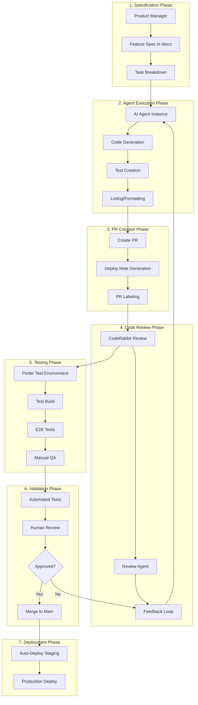

# Agentic Feature Building Workflow

## Overview
This document outlines the automated workflow for building new features using AI agents (Claude Code, Devin, etc.) integrated with our existing CI/CD infrastructure.

## Workflow Architecture



## Detailed Phase Descriptions

### 1. Specification Phase

#### Feature Specification Structure
```markdown
# Feature: [Feature Name]
Location: /docs/features/[feature-name].md

## Overview
Brief description of the feature and its business value.

## User Stories
- As a [user type], I want to [action] so that [benefit]
- ...

## Technical Requirements
### Backend (Spark)
- [ ] API endpoints needed
- [ ] Database schema changes
- [ ] Queue jobs required
- [ ] External service integrations

### Frontend (App)
- [ ] Screens/components to create
- [ ] State management requirements
- [ ] Navigation flow changes

### Shared (Kindling)
- [ ] Shared types/interfaces
- [ ] Utility functions
- [ ] Constants

## Acceptance Criteria
- [ ] Specific measurable criteria
- [ ] Performance requirements
- [ ] Security considerations

## Test Scenarios
1. Happy path scenarios
2. Edge cases
3. Error scenarios

## Dependencies
- External services
- Database migrations
- Third-party libraries

## Phase Breakdown
1. Phase 1: Core functionality
2. Phase 2: Enhanced features
3. Phase 3: Polish and optimization
```

#### Task List Generation
```yaml
# Generated from spec automatically
tasks:
  phase_1:
    - id: task_1_1
      description: "Create database schema for feature"
      type: backend
      agent: claude-code
      dependencies: []
      
    - id: task_1_2
      description: "Implement core API endpoints"
      type: backend
      agent: claude-code
      dependencies: [task_1_1]
      
    - id: task_1_3
      description: "Create React Native screens"
      type: frontend
      agent: claude-code
      dependencies: [task_1_2]
```

### 2. Agent Execution Phase

#### Agent Configuration
```yaml
agent_config:
  type: claude-code  # or devin
  environment: cloud
  context:
    - spec_file: /docs/features/[feature-name].md
    - codebase_access: full
    - allowed_operations:
      - read_files
      - write_files
      - run_tests
      - execute_commands
    - coding_standards: /ai-context/standards/all-standards.md
    - examples: /docs/payment-method/  # relevant examples
  
  constraints:
    - follow_claude_md_workflow: true
    - max_file_changes_per_pr: 20
    - require_tests: true
    - require_types: true
```

#### Agent Execution Script
```typescript
// scripts/run-agent-task.ts
interface AgentTaskConfig {
  taskId: string;
  specFile: string;
  targetBranch: string;
  agentType: 'claude-code' | 'devin';
}

async function executeAgentTask(config: AgentTaskConfig) {
  // 1. Create feature branch
  await git.checkout(`-b feature/${taskId}`);
  
  // 2. Initialize agent with context
  const agent = await initializeAgent({
    type: config.agentType,
    context: {
      spec: await fs.readFile(config.specFile),
      standards: await loadCodingStandards(),
      taskList: await loadTaskList(config.taskId),
    }
  });
  
  // 3. Execute task
  const result = await agent.execute({
    instructions: generateInstructions(config.taskId),
    validation: {
      linting: true,
      tests: true,
      types: true,
    }
  });
  
  // 4. Create PR
  if (result.success) {
    await createPullRequest({
      title: `feat: ${result.taskDescription}`,
      body: generatePRBody(result),
      labels: ['agent-generated', 'phase-1'],
    });
  }
}
```

### 3. PR Creation Phase

#### Automated PR Template
```markdown
## 🤖 Agent-Generated PR

**Task ID**: {{ task_id }}
**Spec**: [{{ feature_name }}]({{ spec_link }})
**Agent**: {{ agent_type }}
**Phase**: {{ phase_number }}

### Changes Made
{{ auto_generated_summary }}

### Files Modified
{{ file_change_list }}

### Test Coverage
- Unit Tests: {{ unit_test_coverage }}%
- Integration Tests: {{ integration_test_count }}
- E2E Tests: {{ e2e_test_count }}

### Checklist
- [x] Code follows project standards
- [x] Tests written and passing
- [x] Types properly defined
- [x] Linting passes
- [x] Deploy note created

### Dependencies
{{ dependency_list }}

### Review Focus Areas
{{ suggested_review_areas }}
```

#### Deploy Note Generation
```typescript
// Automated deploy note generation
async function generateDeployNote(pr: PullRequest) {
  const template = `
# Deploy Note: ${pr.number}

## Feature: ${pr.feature_name}
**Phase**: ${pr.phase}
**Risk Level**: ${calculateRiskLevel(pr)}

## Changes
${pr.changes.map(c => `- ${c.description}`).join('\n')}

## Testing
${pr.testingInstructions}

## Rollback Plan
${pr.rollbackPlan}

## Monitoring
- [ ] Check ${pr.metrics.join(', ')}
- [ ] Monitor error rates
- [ ] Verify feature flags
`;
  
  await fs.writeFile(
    `dev-utils/deployNotes/${pr.number}.md`,
    template
  );
}
```

### 4. Code Review Phase

#### Review Agent Configuration
```yaml
review_agent_config:
  triggers:
    - coderabbit_complete
    - ci_checks_pass
  
  focus_areas:
    - code_standards_compliance
    - security_vulnerabilities
    - performance_issues
    - test_coverage
    - type_safety
    - business_logic_correctness
  
  actions:
    - comment_on_pr
    - suggest_changes
    - approve_if_clean
    - request_changes
```

#### Feedback Loop Implementation
```typescript
interface ReviewFeedback {
  severity: 'critical' | 'major' | 'minor' | 'suggestion';
  file: string;
  line: number;
  issue: string;
  suggestion: string;
}

async function processFeedback(
  feedback: ReviewFeedback[],
  agentTask: AgentTask
) {
  const criticalIssues = feedback.filter(f => 
    f.severity === 'critical'
  );
  
  if (criticalIssues.length > 0) {
    // Re-engage agent with feedback
    await agent.revise({
      task: agentTask,
      feedback: criticalIssues,
      instructions: 'Fix critical issues maintaining existing functionality'
    });
  }
}
```

### 5. Testing Phase

#### Porter Environment Setup
```yaml
# porter/feature-test.yaml
name: feature-{{ feature_name }}-{{ pr_number }}
services:
  api:
    image: "{{ pr_build_image }}"
    env:
      DATABASE_URL: "{{ test_db_url }}"
      FEATURE_FLAGS: "{{ feature_flags }}"
    
  workers:
    image: "{{ pr_build_image }}"
    command: ["yarn", "worker"]
    
  app:
    type: expo
    channel: "pr-{{ pr_number }}"
```

#### Automated Test Suite
```typescript
// Auto-generated test suite
describe('Feature: {{ feature_name }}', () => {
  describe('API Tests', () => {
    // Generated from spec acceptance criteria
    test.each(acceptanceCriteria)('should %s', async (criteria) => {
      const result = await testCriteria(criteria);
      expect(result).toBe(true);
    });
  });
  
  describe('E2E Tests', () => {
    // Maestro flows generated from user stories
    test('complete user flow', async () => {
      await maestro.runFlow('features/{{ feature_name }}/flow.yaml');
    });
  });
});
```

### 6. Validation Phase

#### Automated Validation Checklist
```yaml
validation:
  automated:
    - all_tests_pass: true
    - code_coverage: "> 80%"
    - no_type_errors: true
    - no_lint_errors: true
    - performance_benchmarks: "within 10% of baseline"
    - security_scan: "no high/critical issues"
    
  manual:
    - ui_matches_design: true
    - user_flow_smooth: true
    - edge_cases_handled: true
    - error_messages_clear: true
```

#### Human Review Interface
```typescript
interface ReviewCheckpoint {
  reviewer: string;
  timestamp: Date;
  status: 'approved' | 'needs_changes';
  comments: string[];
  testResults: {
    functionality: boolean;
    performance: boolean;
    usability: boolean;
  };
}
```

### 7. Deployment Phase

#### Phased Rollout Strategy
```yaml
deployment:
  staging:
    automatic: true
    on: merge_to_main
    
  production:
    strategy: phased
    phases:
      - percentage: 5
        duration: 1h
        monitor: error_rate < 0.1%
      - percentage: 25
        duration: 4h
        monitor: error_rate < 0.1%
      - percentage: 100
        monitor: continuous
```

## Implementation Tools

### 1. Agent Runner Service
```typescript
// services/agent-runner/index.ts
export class AgentRunnerService {
  async runFeatureTask(config: FeatureTaskConfig) {
    // 1. Validate permissions
    await this.validateAccess(config);
    
    // 2. Provision agent environment
    const env = await this.provisionEnvironment({
      type: config.agentType,
      resources: {
        cpu: 4,
        memory: '16GB',
        timeout: '2h'
      }
    });
    
    // 3. Execute with monitoring
    return await this.executeWithMonitoring(env, config);
  }
}
```

### 2. Feedback Aggregator
```typescript
// services/feedback-aggregator/index.ts
export class FeedbackAggregator {
  async collectFeedback(prNumber: number): Promise<AggregatedFeedback> {
    const [
      codeRabbitFeedback,
      reviewAgentFeedback,
      ciFeedback,
      humanFeedback
    ] = await Promise.all([
      this.getCodeRabbitFeedback(prNumber),
      this.getReviewAgentFeedback(prNumber),
      this.getCIFeedback(prNumber),
      this.getHumanFeedback(prNumber)
    ]);
    
    return this.aggregate({
      codeRabbit: codeRabbitFeedback,
      reviewAgent: reviewAgentFeedback,
      ci: ciFeedback,
      human: humanFeedback
    });
  }
}
```

### 3. Test Environment Manager
```typescript
// services/test-env-manager/index.ts
export class TestEnvironmentManager {
  async createForPR(pr: PullRequest): Promise<TestEnvironment> {
    // 1. Build PR image
    const image = await this.buildPRImage(pr);
    
    // 2. Deploy to Porter
    const deployment = await this.deployToPorter({
      pr,
      image,
      config: this.generatePorterConfig(pr)
    });
    
    // 3. Run test suite
    const testResults = await this.runTests(deployment);
    
    return {
      url: deployment.url,
      testResults,
      logs: deployment.logs
    };
  }
}
```

## Integration with Existing Systems

### GitHub Actions Integration
```yaml
# .github/workflows/agent-feature-build.yml
name: Agent Feature Build
on:
  workflow_dispatch:
    inputs:
      feature_spec:
        description: 'Path to feature spec'
        required: true
      agent_type:
        description: 'Agent type (claude-code/devin)'
        default: 'claude-code'

jobs:
  execute-feature:
    runs-on: ubuntu-latest
    steps:
      - uses: actions/checkout@v3
      
      - name: Initialize Agent
        uses: ./.github/actions/init-agent
        with:
          type: ${{ inputs.agent_type }}
          
      - name: Execute Feature Tasks
        run: |
          node scripts/execute-feature.js \
            --spec=${{ inputs.feature_spec }} \
            --agent=${{ inputs.agent_type }}
```

### Monitoring Dashboard
```typescript
// monitoring/feature-dashboard.tsx
export function FeatureDashboard() {
  return (
    <Dashboard>
      <MetricCard title="Active Features" value={activeFeatures} />
      <MetricCard title="Agent Success Rate" value={successRate} />
      <MetricCard title="Avg Time to Deploy" value={avgDeployTime} />
      
      <FeatureTimeline features={features} />
      <AgentPerformance agents={agents} />
      <FeedbackSummary feedback={aggregatedFeedback} />
    </Dashboard>
  );
}
```

## Success Metrics

1. **Development Velocity**
   - Time from spec to deployed feature
   - Number of features completed per sprint
   - Agent utilization rate

2. **Code Quality**
   - Test coverage percentage
   - CodeRabbit approval rate
   - Bug escape rate

3. **Developer Satisfaction**
   - Time saved vs manual development
   - Feedback quality score
   - Feature adoption rate

## Best Practices

1. **Specification Quality**
   - Clear, measurable acceptance criteria
   - Comprehensive test scenarios
   - Well-defined phases

2. **Agent Management**
   - Regular context updates
   - Incremental task breakdown
   - Clear success criteria

3. **Review Process**
   - Focus on business logic
   - Trust automated checks
   - Quick feedback loops

4. **Deployment Safety**
   - Feature flags for all new features
   - Gradual rollout
   - Automated rollback triggers