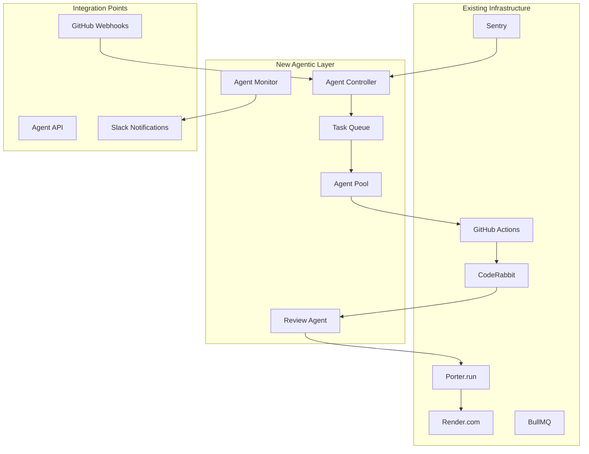

# Agentic Workflows - Integration Design

## Overview
This document details how the agentic workflows integrate with Blaze's existing CI/CD infrastructure, leveraging current tools and patterns while adding new automation capabilities.

## Current Infrastructure Analysis

### Existing CI/CD Components
```yaml
github_actions:
  lint: ESLint validation on PRs
  merge_gatekeeper: Ensures all checks pass
  expo_updates: Auto-publishes mobile updates
  deploy_notes: Validates PR deploy notes
  gumloop_qa: Triggers QA automation
  
deployment_platforms:
  render: Production deployments
  porter: Staging and test environments
  expo: Mobile app distribution
  
code_quality:
  coderabbit: Automated code review
  eslint: Code linting
  jest: Unit testing
  maestro: E2E testing
  
monitoring:
  sentry: Error tracking
  bull_ui: Queue monitoring
  structured_logging: Application logs
```

### Current Workflow Patterns
1. **PR-based deployments**: Different branches trigger different environments
2. **Automated quality checks**: Linting, testing, and code review
3. **Deploy notes requirement**: Each PR needs documentation
4. **Worker architecture**: Separate processes for different concerns
5. **Queue-based processing**: BullMQ for background tasks

## Integration Architecture

### High-Level Integration Flow


### Core Integration Components

#### 1. Agent Controller Service
```typescript
// services/agent-controller/index.ts
export class AgentControllerService {
  constructor(
    private readonly github: GitHubService,
    private readonly porter: PorterService,
    private readonly render: RenderService,
    private readonly sentry: SentryService,
    private readonly slack: SlackService
  ) {}
  
  async handleFeatureRequest(request: FeatureRequest): Promise<void> {
    // 1. Validate request
    await this.validateFeatureRequest(request);
    
    // 2. Create GitHub issue
    const issue = await this.github.createIssue({
      title: `Feature: ${request.title}`,
      body: this.generateFeatureIssueBody(request),
      labels: ['feature', 'agent-generated']
    });
    
    // 3. Queue agent task
    await this.queueAgentTask({
      type: 'feature',
      issueId: issue.id,
      spec: request.spec,
      priority: request.priority
    });
    
    // 4. Notify stakeholders
    await this.notifyStakeholders(issue, request);
  }
  
  async handleBugReport(bug: BugReport): Promise<void> {
    // 1. Triage bug
    const triage = await this.triageBug(bug);
    
    // 2. Auto-fix if eligible
    if (triage.autoFixEligible) {
      await this.queueAgentTask({
        type: 'bug_fix',
        bugId: bug.id,
        analysis: triage.analysis,
        priority: triage.priority
      });
    }
    
    // 3. Create GitHub issue if needed
    if (!triage.autoFixEligible) {
      await this.createBugIssue(bug, triage);
    }
  }
}
```

#### 2. Enhanced GitHub Actions
```yaml
# .github/workflows/agent-trigger.yml
name: Agent Workflow Trigger
on:
  workflow_dispatch:
    inputs:
      workflow_type:
        description: 'Type of workflow (feature/bug_fix)'
        required: true
        type: choice
        options:
          - feature
          - bug_fix
      spec_path:
        description: 'Path to specification file'
        required: true
      priority:
        description: 'Priority level'
        default: 'medium'
        type: choice
        options:
          - critical
          - high
          - medium
          - low

jobs:
  trigger-agent:
    runs-on: ubuntu-latest
    steps:
      - name: Checkout
        uses: actions/checkout@v3
        
      - name: Validate Spec
        run: |
          if [ ! -f "${{ inputs.spec_path }}" ]; then
            echo "Spec file not found: ${{ inputs.spec_path }}"
            exit 1
          fi
          
      - name: Trigger Agent
        uses: ./.github/actions/trigger-agent
        with:
          workflow_type: ${{ inputs.workflow_type }}
          spec_path: ${{ inputs.spec_path }}
          priority: ${{ inputs.priority }}
          github_token: ${{ secrets.GITHUB_TOKEN }}
```

#### 3. Agent Integration with Existing CodeRabbit
```yaml
# coderabbit.yaml - Enhanced configuration
reviews:
  request_changes_workflow: true
  high_level_summary: true
  poem: false
  review_status: true
  collapse_empty_files: true
  
  # Agent-specific rules
  agent_generated_prs:
    enable: true
    focus_areas:
      - code_standards_compliance
      - security_vulnerabilities
      - performance_issues
      - test_coverage
    
    auto_approve_conditions:
      - all_checks_pass: true
      - no_high_severity_issues: true
      - test_coverage: "> 80%"
      - agent_confidence: "> 95%"
```

#### 4. Enhanced Deploy Notes for Agent PRs
```typescript
// Enhanced deploy note generator
export class AgentDeployNoteGenerator {
  async generateDeployNote(pr: AgentPR): Promise<string> {
    const template = `
# Deploy Note: ${pr.number}

## 🤖 Agent-Generated ${pr.type === 'feature' ? 'Feature' : 'Bug Fix'}
**Agent**: ${pr.agent.type}
**Task ID**: ${pr.taskId}
**Priority**: ${pr.priority}
**Confidence**: ${pr.agent.confidence}%

## Summary
${pr.summary}

## Changes Made
${pr.changes.map(c => `- ${c.description}`).join('\n')}

## Test Coverage
- Unit Tests: ${pr.testCoverage.unit}%
- Integration Tests: ${pr.testCoverage.integration} added
- E2E Tests: ${pr.testCoverage.e2e} scenarios

## Verification Steps
\`\`\`bash
# Automated verification
${pr.verificationSteps.join('\n')}
\`\`\`

## Risk Assessment
- **Level**: ${pr.riskLevel}
- **Mitigation**: ${pr.riskMitigation}
- **Rollback**: ${pr.rollbackPlan}

## Agent Confidence Factors
${pr.agent.confidenceFactors.map(f => `- ${f}`).join('\n')}

## Related Issues
${pr.relatedIssues.map(i => `- Closes #${i}`).join('\n')}
`;
    
    return template;
  }
}
```

### Integration with Existing Services

#### 1. Porter Integration for Test Environments
```typescript
// services/porter-integration/index.ts
export class PorterIntegration {
  async createAgentTestEnvironment(pr: AgentPR): Promise<TestEnvironment> {
    const config = {
      name: `agent-${pr.type}-${pr.number}`,
      cluster: 'blaze-staging',
      services: {
        api: {
          image: `registry.render.com/blaze/api:pr-${pr.number}`,
          env: {
            ...this.getBaseEnv(),
            FEATURE_FLAGS: this.getFeatureFlags(pr),
            AGENT_TEST_MODE: 'true'
          },
          resources: {
            cpu: '0.5',
            memory: '1Gi'
          }
        },
        worker: {
          image: `registry.render.com/blaze/worker:pr-${pr.number}`,
          env: this.getBaseEnv(),
          replicas: 1
        }
      }
    };
    
    const deployment = await this.porter.deploy(config);
    
    // Wait for deployment readiness
    await this.waitForDeployment(deployment);
    
    return {
      url: deployment.url,
      apiEndpoint: `${deployment.url}/graphql`,
      dashboardUrl: `${deployment.url}/bull-board`,
      logs: deployment.logs
    };
  }
}
```

#### 2. Render Integration for Production Deployments
```typescript
// services/render-integration/index.ts
export class RenderIntegration {
  async deployAgentChanges(pr: AgentPR): Promise<Deployment> {
    // Only deploy if agent confidence is high and tests pass
    if (pr.agent.confidence < 95 || !pr.testsPass) {
      throw new Error('Agent deployment requirements not met');
    }
    
    // Use existing render.yaml configuration
    const deployment = await this.render.deploy({
      service: 'blaze-api',
      branch: pr.branch,
      environment: pr.targetEnvironment,
      buildCommand: 'yarn build',
      startCommand: 'yarn start'
    });
    
    // Monitor deployment
    await this.monitorDeployment(deployment);
    
    return deployment;
  }
}
```

#### 3. Sentry Integration for Bug Detection
```typescript
// services/sentry-integration/index.ts
export class SentryIntegration {
  @WebhookHandler('/webhooks/sentry')
  async handleSentryAlert(alert: SentryAlert): Promise<void> {
    // 1. Parse and classify
    const classification = await this.classifyAlert(alert);
    
    // 2. Check if auto-fixable
    if (classification.autoFixable) {
      await this.agentController.handleBugReport({
        source: 'sentry',
        alert,
        classification,
        priority: this.calculatePriority(classification)
      });
    }
    
    // 3. Create issue for manual review
    else {
      await this.createManualIssue(alert, classification);
    }
  }
  
  private async classifyAlert(alert: SentryAlert): Promise<AlertClassification> {
    // Use existing patterns to classify
    const patterns = await this.getKnownPatterns();
    const match = patterns.find(p => p.matches(alert));
    
    return {
      type: match?.type || 'unknown',
      severity: this.calculateSeverity(alert),
      autoFixable: match?.autoFixable || false,
      confidence: match?.confidence || 0
    };
  }
}
```

#### 4. Enhanced BullMQ Integration
```typescript
// queues/agent-task.queue.ts
export class AgentTaskQueue {
  @Process('feature-task')
  async processFeatureTask(job: Job<FeatureTask>): Promise<void> {
    const { taskId, spec, priority } = job.data;
    
    try {
      // 1. Initialize agent
      const agent = await this.agentPool.acquire({
        type: 'claude-code',
        task: 'feature',
        resources: this.getResourceRequirements(spec)
      });
      
      // 2. Execute task
      const result = await agent.execute({
        spec,
        context: await this.buildContext(spec),
        validation: {
          tests: true,
          linting: true,
          types: true
        }
      });
      
      // 3. Create PR
      if (result.success) {
        await this.createPR(result);
      }
      
    } catch (error) {
      // 4. Handle failure
      await this.handleTaskFailure(job, error);
    }
  }
  
  @Process('bug-fix-task')
  async processBugFixTask(job: Job<BugFixTask>): Promise<void> {
    const { bugId, analysis, priority } = job.data;
    
    // Similar implementation for bug fixes
    // ...
  }
}
```

### Enhanced Monitoring and Observability

#### 1. Agent Performance Monitoring
```typescript
// services/agent-monitor/index.ts
export class AgentMonitoringService {
  async trackAgentPerformance(
    agentId: string,
    task: AgentTask,
    result: AgentResult
  ): Promise<void> {
    const metrics = {
      agent_id: agentId,
      task_type: task.type,
      duration: result.duration,
      success: result.success,
      confidence: result.confidence,
      lines_changed: result.linesChanged,
      tests_added: result.testsAdded,
      timestamp: new Date()
    };
    
    // Send to existing monitoring stack
    await this.metrics.record(metrics);
    
    // Create dashboard entry
    await this.createDashboardEntry(metrics);
    
    // Alert on anomalies
    if (this.isAnomalous(metrics)) {
      await this.alertOnAnomaly(metrics);
    }
  }
}
```

#### 2. Integration with Existing Logging
```typescript
// Enhanced logging for agent operations
export class AgentLogger {
  constructor(
    private readonly logger: AppLogger // Use existing logger
  ) {}
  
  logAgentTaskStart(task: AgentTask): void {
    this.logger.info('Agent task started', {
      taskId: task.id,
      type: task.type,
      agent: task.agent.type,
      priority: task.priority,
      correlationId: task.correlationId
    });
  }
  
  logAgentTaskComplete(task: AgentTask, result: AgentResult): void {
    this.logger.info('Agent task completed', {
      taskId: task.id,
      success: result.success,
      duration: result.duration,
      confidence: result.confidence,
      prNumber: result.prNumber,
      correlationId: task.correlationId
    });
  }
}
```

### Development Workflow Integration

#### 1. CLI Integration
```typescript
// cli/commands/agent.ts
export class AgentCommand {
  @Command('agent feature')
  async createFeature(
    @Option('spec') specPath: string,
    @Option('priority') priority: string = 'medium'
  ): Promise<void> {
    // Validate spec exists
    if (!fs.existsSync(specPath)) {
      throw new Error(`Spec file not found: ${specPath}`);
    }
    
    // Trigger agent workflow
    await this.agentController.handleFeatureRequest({
      spec: await fs.readFile(specPath, 'utf8'),
      priority: priority as Priority,
      requestor: this.getCurrentUser()
    });
    
    console.log('Feature request submitted to agent queue');
  }
  
  @Command('agent fix')
  async fixBug(
    @Option('issue') issueNumber: number,
    @Option('priority') priority: string = 'medium'
  ): Promise<void> {
    // Get issue details
    const issue = await this.github.getIssue(issueNumber);
    
    // Trigger bug fix workflow
    await this.agentController.handleBugReport({
      source: 'manual',
      issue,
      priority: priority as Priority,
      requestor: this.getCurrentUser()
    });
    
    console.log(`Bug fix request submitted for issue #${issueNumber}`);
  }
}
```

#### 2. VS Code Extension Integration
```typescript
// vscode-extension/src/agent-provider.ts
export class AgentProvider implements vscode.TreeDataProvider<AgentTask> {
  async getChildren(element?: AgentTask): Promise<AgentTask[]> {
    if (!element) {
      return this.getActiveAgentTasks();
    }
    return [];
  }
  
  async createFeatureFromSpec(): Promise<void> {
    const specFile = await vscode.window.showOpenDialog({
      filters: { 'Markdown': ['md'] },
      canSelectMany: false
    });
    
    if (specFile) {
      await this.agentService.createFeature(specFile[0].fsPath);
      vscode.window.showInformationMessage('Feature request submitted to agent');
    }
  }
}
```

### Configuration and Environment Management

#### 1. Environment-Specific Agent Configuration
```yaml
# config/agent-config.yaml
environments:
  development:
    agent_pool_size: 2
    timeout: 30m
    resources:
      cpu: 2
      memory: 4Gi
    
  staging:
    agent_pool_size: 4
    timeout: 60m
    resources:
      cpu: 4
      memory: 8Gi
    
  production:
    agent_pool_size: 8
    timeout: 120m
    resources:
      cpu: 8
      memory: 16Gi
```

#### 2. Feature Flag Integration
```typescript
// services/feature-flags/agent-flags.ts
export class AgentFeatureFlags {
  @FeatureFlag('agent_feature_generation')
  async featureGenerationEnabled(): Promise<boolean> {
    return this.featureFlags.isEnabled('agent_feature_generation');
  }
  
  @FeatureFlag('agent_bug_fixing')
  async bugFixingEnabled(): Promise<boolean> {
    return this.featureFlags.isEnabled('agent_bug_fixing');
  }
  
  @FeatureFlag('agent_auto_deploy')
  async autoDeployEnabled(): Promise<boolean> {
    return this.featureFlags.isEnabled('agent_auto_deploy');
  }
}
```

## Migration Strategy

### Phase 1: Foundation (Weeks 1-2)
1. Set up agent controller service
2. Create basic GitHub Actions integrations
3. Implement task queueing system
4. Add monitoring and logging

### Phase 2: Feature Workflow (Weeks 3-4)
1. Implement feature generation workflow
2. Integrate with Porter for test environments
3. Add PR creation and management
4. Create feedback loop with CodeRabbit

### Phase 3: Bug Fixing Workflow (Weeks 5-6)
1. Implement Sentry integration
2. Add bug analysis and fixing capabilities
3. Create hotfix deployment pipeline
4. Add post-deployment monitoring

### Phase 4: Advanced Features (Weeks 7-8)
1. Add CLI and VS Code integrations
2. Implement advanced analytics
3. Add agent performance optimization
4. Create comprehensive documentation

## Success Metrics

### Integration Health
- Agent task success rate: > 85%
- Integration test pass rate: > 95%
- Deployment failure rate: < 5%

### Performance Metrics
- Time to PR creation: < 2 hours
- Code review time: < 30 minutes
- Time to deployment: < 1 hour

### Quality Metrics
- Bug regression rate: < 2%
- Test coverage: > 80%
- CodeRabbit approval rate: > 90%

This integration design leverages all existing infrastructure while adding the new agentic capabilities, ensuring a smooth transition and maximum utilization of current investments.