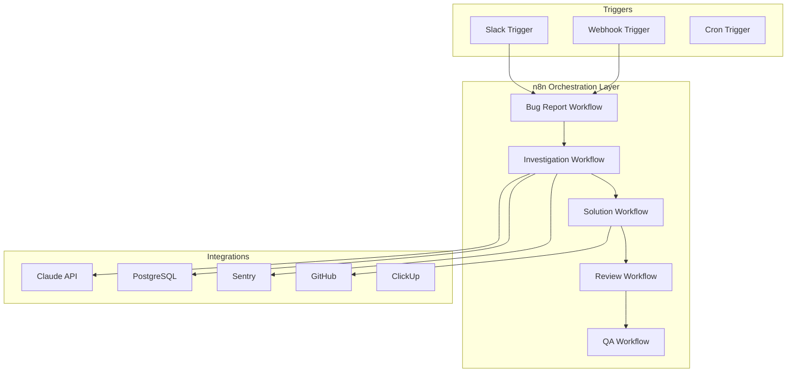

# Implementing Agentic Workflows with n8n

## Overview
n8n is an open-source workflow automation platform that provides the perfect orchestration layer for our multi-agent bug fixing system. Its visual workflow builder, extensive integrations, and self-hosting capabilities make it ideal for implementing complex agentic workflows.

## Why n8n for Agentic Workflows?

### Key Advantages
- **Visual Workflow Design**: See and modify agent interactions visually
- **Built-in Integrations**: Native nodes for Slack, GitHub, PostgreSQL, HTTP requests
- **Self-Hosted**: Full control over data and execution environment
- **Error Handling**: Built-in retry logic and error workflows
- **Scalability**: Can handle complex branching and parallel execution
- **Monitoring**: Real-time execution monitoring and logs
- **Version Control**: Workflows can be exported as JSON and versioned

## Architecture Overview



## Workflow Implementation

### 1. Main Bug Report Workflow

```json
{
  "name": "Bug Report Handler",
  "nodes": [
    {
      "name": "Slack Trigger",
      "type": "n8n-nodes-base.slackTrigger",
      "parameters": {
        "event": "slash_command",
        "command": "/bug-report"
      }
    },
    {
      "name": "Parse Bug Report",
      "type": "n8n-nodes-base.function",
      "parameters": {
        "functionCode": `
          const report = {
            reporter: $input.item.user_name,
            channel: $input.item.channel_id,
            description: $input.item.text,
            timestamp: new Date().toISOString(),
            reportId: crypto.randomUUID()
          };
          return { json: report };
        `
      }
    },
    {
      "name": "Start Investigation",
      "type": "n8n-nodes-base.executeWorkflow",
      "parameters": {
        "workflowId": "investigation-workflow-id",
        "inputData": "={{ $json }}"
      }
    },
    {
      "name": "Respond to Slack",
      "type": "n8n-nodes-base.slack",
      "parameters": {
        "operation": "postMessage",
        "channel": "={{ $node['Parse Bug Report'].json.channel }}",
        "text": "🔍 Bug report received! Investigation started.\nTracking ID: {{ $node['Parse Bug Report'].json.reportId }}"
      }
    }
  ]
}
```

### 2. Investigation Workflow

This workflow performs the deep investigation using multiple data sources:

```yaml
name: Bug Investigation Workflow
trigger: Execute Workflow Trigger

nodes:
  - name: Receive Bug Report
    type: Execute Workflow Trigger
    
  - name: Query Production DB
    type: PostgreSQL
    parameters:
      operation: executeQuery
      query: |
        SELECT * FROM errors 
        WHERE created_at > NOW() - INTERVAL '24 hours'
        AND description LIKE '%{{ $json.searchTerm }}%'
        LIMIT 100
      
  - name: Search Sentry Errors
    type: HTTP Request
    parameters:
      method: GET
      url: https://sentry.io/api/0/projects/blaze/events/
      headers:
        Authorization: Bearer {{ $credentials.sentryToken }}
      queryParameters:
        query: "{{ $json.description }}"
        
  - name: Get Betterstack Logs
    type: HTTP Request
    parameters:
      method: POST
      url: https://api.betterstack.com/logs/search
      headers:
        Authorization: Bearer {{ $credentials.betterstackToken }}
      body:
        query: "{{ $json.description }}"
        from: "{{ $json.timestamp - 24h }}"
        
  - name: Claude Investigation
    type: HTTP Request
    parameters:
      method: POST
      url: https://api.anthropic.com/v1/messages
      headers:
        x-api-key: "{{ $credentials.claudeApiKey }}"
        anthropic-version: "2023-06-01"
      body:
        model: "claude-3-opus-20240229"
        max_tokens: 4000
        messages:
          - role: "user"
            content: |
              Investigate this bug report:
              {{ $node['Receive Bug Report'].json.description }}
              
              Database findings:
              {{ $node['Query Production DB'].json }}
              
              Sentry errors:
              {{ $node['Search Sentry Errors'].json }}
              
              Recent logs:
              {{ $node['Get Betterstack Logs'].json }}
              
              Provide:
              1. Root cause analysis
              2. Affected users/impact
              3. Priority (Urgent/High/Normal/Low)
              4. Suggested fix approach
              
  - name: Create ClickUp Ticket
    type: HTTP Request
    parameters:
      method: POST
      url: https://api.clickup.com/api/v2/list/{{ listId }}/task
      headers:
        Authorization: "{{ $credentials.clickupToken }}"
      body:
        name: "[BUG] {{ $node['Claude Investigation'].json.summary }}"
        description: "{{ $node['Claude Investigation'].json.fullAnalysis }}"
        priority: "{{ $node['Claude Investigation'].json.priority }}"
        custom_fields:
          - id: "agent_confidence"
            value: "{{ $node['Claude Investigation'].json.confidence }}"
            
  - name: Trigger Solution Workflow
    type: Execute Workflow
    parameters:
      workflowId: "solution-workflow-id"
      inputData:
        ticketId: "{{ $node['Create ClickUp Ticket'].json.id }}"
        investigation: "{{ $node['Claude Investigation'].json }}"
```

### 3. Solution Generation Workflow

```yaml
name: Solution Generation Workflow

nodes:
  - name: Receive Investigation
    type: Execute Workflow Trigger
    
  - name: Get Related Code
    type: GitHub
    parameters:
      operation: getFileContent
      owner: blaze-xyz
      repository: "{{ $json.repository }}"
      path: "{{ $json.affectedFile }}"
      
  - name: Claude Generate Fix
    type: HTTP Request
    parameters:
      method: POST
      url: https://api.anthropic.com/v1/messages
      body:
        model: "claude-3-opus-20240229"
        messages:
          - role: "user"
            content: |
              Generate a fix for this bug:
              
              Investigation: {{ $json.investigation }}
              Current code: {{ $node['Get Related Code'].json.content }}
              
              Provide:
              1. Minimal code changes
              2. Test cases
              3. Explanation
              
  - name: Create Branch
    type: GitHub
    parameters:
      operation: createBranch
      owner: blaze-xyz
      repository: blaze-platform
      branch: "fix/{{ $json.ticketId }}"
      
  - name: Create Fix Commit
    type: GitHub
    parameters:
      operation: createFile
      owner: blaze-xyz
      repository: blaze-platform
      branch: "{{ $node['Create Branch'].json.branch }}"
      path: "{{ $json.filePath }}"
      content: "{{ $node['Claude Generate Fix'].json.fixedCode }}"
      message: "fix: {{ $json.commitMessage }}"
      
  - name: Create PR
    type: GitHub
    parameters:
      operation: createPullRequest
      owner: blaze-xyz
      repository: blaze-platform
      title: "🤖 Fix: {{ $json.bugSummary }}"
      body: |
        ## Automated Bug Fix
        
        **ClickUp Ticket**: [#{{ $json.ticketId }}]({{ $json.ticketUrl }})
        
        ### Changes
        {{ $node['Claude Generate Fix'].json.explanation }}
        
        ### Tests
        {{ $node['Claude Generate Fix'].json.tests }}
        
  - name: Trigger Review
    type: Execute Workflow
    parameters:
      workflowId: "review-workflow-id"
      inputData:
        prNumber: "{{ $node['Create PR'].json.number }}"
        fix: "{{ $node['Claude Generate Fix'].json }}"
```

### 4. Review & Iteration Workflow

```yaml
name: Code Review Workflow

nodes:
  - name: Receive PR for Review
    type: Execute Workflow Trigger
    
  - name: Claude Review Code
    type: HTTP Request
    parameters:
      method: POST
      url: https://api.anthropic.com/v1/messages
      body:
        messages:
          - role: "user"
            content: |
              Review this code fix:
              {{ $json.fix }}
              
              Check for:
              - Code quality
              - Security issues
              - Performance impact
              - Test coverage
              
  - name: Check Review Result
    type: Switch
    parameters:
      rules:
        - when: "{{ $node['Claude Review Code'].json.approved === true }}"
          output: "Approved"
        - when: "{{ $node['Claude Review Code'].json.needsChanges === true }}"
          output: "Needs Changes"
          
  - name: Request Changes
    type: GitHub
    parameters:
      operation: createPullRequestReview
      state: "REQUEST_CHANGES"
      body: "{{ $node['Claude Review Code'].json.feedback }}"
      
  - name: Iterate Fix
    type: Execute Workflow
    parameters:
      workflowId: "solution-workflow-id"
      inputData:
        feedback: "{{ $node['Claude Review Code'].json.feedback }}"
        iteration: "{{ $json.iteration + 1 }}"
```

### 5. QA Automation Workflow

```yaml
name: QA Testing Workflow

nodes:
  - name: Receive Approved PR
    type: Execute Workflow Trigger
    
  - name: Deploy to Test Environment
    type: HTTP Request
    parameters:
      method: POST
      url: "{{ $env.PORTER_API }}/deploy"
      body:
        pr_number: "{{ $json.prNumber }}"
        environment: "test"
        
  - name: Wait for Deployment
    type: Wait
    parameters:
      amount: 30
      unit: "seconds"
      
  - name: Run Test Suite
    type: SSH
    parameters:
      command: |
        cd /app
        npm test -- --testNamePattern="{{ $json.testPattern }}"
        
  - name: Capture Test Results
    type: Function
    parameters:
      functionCode: |
        const results = {
          passed: $items[0].json.exitCode === 0,
          output: $items[0].json.stdout,
          errors: $items[0].json.stderr
        };
        return { json: results };
        
  - name: Update PR Status
    type: GitHub
    parameters:
      operation: createCommitStatus
      state: "{{ $json.passed ? 'success' : 'failure' }}"
      description: "QA Tests {{ $json.passed ? 'passed' : 'failed' }}"
```

## n8n Configuration

### 1. Environment Variables

```env
# n8n Configuration
N8N_BASIC_AUTH_ACTIVE=true
N8N_BASIC_AUTH_USER=admin
N8N_BASIC_AUTH_PASSWORD=secure-password
N8N_ENCRYPTION_KEY=your-encryption-key
WEBHOOK_URL=https://n8n.blaze.xyz

# API Keys (stored in n8n credentials)
CLAUDE_API_KEY=your-claude-key
GITHUB_TOKEN=your-github-token
SLACK_BOT_TOKEN=your-slack-token
CLICKUP_API_KEY=your-clickup-key
SENTRY_AUTH_TOKEN=your-sentry-token
BETTERSTACK_API_KEY=your-betterstack-key

# Database
POSTGRES_HOST=your-db-host
POSTGRES_PORT=5432
POSTGRES_DB=production
POSTGRES_USER=readonly_user
POSTGRES_PASSWORD=secure-password
```

### 2. Docker Compose Setup

```yaml
version: '3.8'

services:
  n8n:
    image: n8nio/n8n:latest
    container_name: blaze-n8n
    restart: always
    ports:
      - "5678:5678"
    environment:
      - N8N_BASIC_AUTH_ACTIVE=true
      - N8N_BASIC_AUTH_USER=admin
      - N8N_BASIC_AUTH_PASSWORD=${N8N_PASSWORD}
      - N8N_ENCRYPTION_KEY=${N8N_ENCRYPTION_KEY}
      - N8N_HOST=n8n.blaze.xyz
      - N8N_PORT=5678
      - N8N_PROTOCOL=https
      - WEBHOOK_URL=https://n8n.blaze.xyz
      - NODE_ENV=production
    volumes:
      - n8n_data:/home/node/.n8n
      - ./workflows:/workflows
    networks:
      - blaze-network

  n8n-postgres:
    image: postgres:15
    container_name: n8n-postgres
    restart: always
    environment:
      - POSTGRES_USER=n8n
      - POSTGRES_PASSWORD=${N8N_DB_PASSWORD}
      - POSTGRES_DB=n8n
    volumes:
      - n8n_postgres_data:/var/lib/postgresql/data
    networks:
      - blaze-network

volumes:
  n8n_data:
  n8n_postgres_data:

networks:
  blaze-network:
    external: true
```

## Custom n8n Nodes

### 1. Claude MCP Node

Create a custom node for better Claude integration:

```typescript
// nodes/ClaudeMCP/ClaudeMCP.node.ts
import {
  IExecuteFunctions,
  INodeExecutionData,
  INodeType,
  INodeTypeDescription,
} from 'n8n-workflow';

export class ClaudeMCP implements INodeType {
  description: INodeTypeDescription = {
    displayName: 'Claude MCP',
    name: 'claudeMcp',
    group: ['transform'],
    version: 1,
    description: 'Interact with Claude using MCP tools',
    defaults: {
      name: 'Claude MCP',
    },
    inputs: ['main'],
    outputs: ['main'],
    credentials: [
      {
        name: 'claudeApi',
        required: true,
      },
    ],
    properties: [
      {
        displayName: 'MCP Tool',
        name: 'mcpTool',
        type: 'options',
        options: [
          { name: 'PostgreSQL Query', value: 'postgres' },
          { name: 'Search Logs', value: 'logs' },
          { name: 'Analyze Errors', value: 'errors' },
        ],
        default: 'postgres',
      },
      {
        displayName: 'Prompt',
        name: 'prompt',
        type: 'string',
        typeOptions: {
          rows: 10,
        },
        default: '',
      },
    ],
  };

  async execute(this: IExecuteFunctions): Promise<INodeExecutionData[][]> {
    const items = this.getInputData();
    const mcpTool = this.getNodeParameter('mcpTool', 0) as string;
    const prompt = this.getNodeParameter('prompt', 0) as string;
    
    // Implementation for Claude MCP interaction
    const response = await this.helpers.requestWithAuthentication(
      'claudeApi',
      {
        method: 'POST',
        url: 'https://api.anthropic.com/v1/messages',
        body: {
          model: 'claude-3-opus-20240229',
          messages: [{
            role: 'user',
            content: `Use MCP tool ${mcpTool} to: ${prompt}`,
          }],
        },
      },
    );

    return [this.helpers.returnJsonArray([response])];
  }
}
```

### 2. Bug Priority Node

Custom node for intelligent bug prioritization:

```typescript
// nodes/BugPriority/BugPriority.node.ts
export class BugPriority implements INodeType {
  description: INodeTypeDescription = {
    displayName: 'Bug Priority Calculator',
    name: 'bugPriority',
    group: ['transform'],
    version: 1,
    description: 'Calculate bug priority based on impact',
    defaults: {
      name: 'Bug Priority',
    },
    inputs: ['main'],
    outputs: ['main'],
    properties: [
      {
        displayName: 'Users Affected',
        name: 'usersAffected',
        type: 'number',
        default: 0,
      },
      {
        displayName: 'Revenue Impact',
        name: 'revenueImpact',
        type: 'number',
        default: 0,
      },
      {
        displayName: 'Security Risk',
        name: 'securityRisk',
        type: 'boolean',
        default: false,
      },
    ],
  };

  async execute(this: IExecuteFunctions): Promise<INodeExecutionData[][]> {
    const items = this.getInputData();
    const returnData: INodeExecutionData[] = [];

    for (let i = 0; i < items.length; i++) {
      const usersAffected = this.getNodeParameter('usersAffected', i) as number;
      const revenueImpact = this.getNodeParameter('revenueImpact', i) as number;
      const securityRisk = this.getNodeParameter('securityRisk', i) as boolean;

      let priority = 'Low';
      let score = 0;

      // Calculate priority score
      if (usersAffected > 1000) score += 40;
      else if (usersAffected > 100) score += 20;
      else if (usersAffected > 10) score += 10;

      if (revenueImpact > 10000) score += 40;
      else if (revenueImpact > 1000) score += 20;
      else if (revenueImpact > 100) score += 10;

      if (securityRisk) score += 50;

      // Determine priority
      if (score >= 80) priority = 'Urgent';
      else if (score >= 50) priority = 'High';
      else if (score >= 20) priority = 'Normal';

      returnData.push({
        json: {
          ...items[i].json,
          priority,
          priorityScore: score,
        },
      });
    }

    return [returnData];
  }
}
```

## Error Handling & Monitoring

### 1. Error Workflow

Create a dedicated error handling workflow:

```yaml
name: Error Handler Workflow

trigger:
  type: Error Trigger
  workflows: ['all']

nodes:
  - name: Capture Error
    type: Function
    code: |
      const error = {
        workflow: $execution.workflowName,
        node: $execution.errorNode,
        message: $execution.error.message,
        timestamp: new Date().toISOString(),
        data: $execution.errorData
      };
      return { json: error };
      
  - name: Log to Sentry
    type: HTTP Request
    parameters:
      method: POST
      url: https://sentry.io/api/0/projects/blaze/events/
      body:
        level: "error"
        message: "{{ $json.message }}"
        extra: "{{ $json }}"
        
  - name: Notify Slack
    type: Slack
    parameters:
      channel: "#eng-alerts"
      text: |
        🚨 Workflow Error
        Workflow: {{ $json.workflow }}
        Node: {{ $json.node }}
        Error: {{ $json.message }}
        Time: {{ $json.timestamp }}
```

### 2. Monitoring Dashboard

```yaml
name: Workflow Monitoring

trigger:
  type: Cron
  pattern: "*/5 * * * *"  # Every 5 minutes

nodes:
  - name: Get Workflow Stats
    type: n8n API
    parameters:
      operation: getExecutions
      filters:
        status: ["error", "success"]
        startedAfter: "{{ $now.minus(5, 'minutes') }}"
        
  - name: Calculate Metrics
    type: Function
    code: |
      const executions = $input.all();
      const total = executions.length;
      const errors = executions.filter(e => e.json.status === 'error').length;
      const success = executions.filter(e => e.json.status === 'success').length;
      
      return {
        json: {
          total,
          errors,
          success,
          errorRate: (errors / total * 100).toFixed(2),
          successRate: (success / total * 100).toFixed(2)
        }
      };
      
  - name: Send to Monitoring
    type: HTTP Request
    parameters:
      method: POST
      url: "{{ $env.MONITORING_ENDPOINT }}"
      body: "{{ $json }}"
```

## Best Practices

### 1. Workflow Organization
```
workflows/
├── triggers/
│   ├── slack-bug-report.json
│   ├── webhook-bug-report.json
│   └── scheduled-checks.json
├── agents/
│   ├── investigation-agent.json
│   ├── solution-agent.json
│   ├── review-agent.json
│   └── qa-agent.json
├── utilities/
│   ├── error-handler.json
│   ├── monitoring.json
│   └── notifications.json
└── templates/
    ├── bug-investigation-template.json
    └── code-review-template.json
```

### 2. Version Control
```bash
# Export workflows for version control
n8n export:workflow --all --output=./workflows

# Import workflows
n8n import:workflow --input=./workflows

# Git workflow
git add workflows/
git commit -m "feat: Update investigation workflow"
git push
```

### 3. Testing Strategy
- Use n8n's test webhook feature
- Create test workflows with mock data
- Implement canary deployments
- Monitor execution logs

### 4. Security Considerations
- Store all credentials in n8n's credential system
- Use read-only database access
- Implement API rate limiting
- Regular credential rotation
- Audit workflow access

## Deployment Options

### 1. Docker Swarm
```bash
docker stack deploy -c docker-compose.yml blaze-n8n
```

### 2. Kubernetes
```yaml
apiVersion: apps/v1
kind: Deployment
metadata:
  name: n8n-deployment
spec:
  replicas: 2
  selector:
    matchLabels:
      app: n8n
  template:
    metadata:
      labels:
        app: n8n
    spec:
      containers:
      - name: n8n
        image: n8nio/n8n:latest
        ports:
        - containerPort: 5678
        env:
        - name: N8N_BASIC_AUTH_ACTIVE
          value: "true"
        volumeMounts:
        - name: n8n-data
          mountPath: /home/node/.n8n
```

### 3. Managed n8n Cloud
- Use n8n.cloud for managed hosting
- Automatic updates and backups
- Built-in monitoring

## Migration from Code to n8n

### Phase 1: Parallel Running
1. Implement n8n workflows alongside existing code
2. Route 10% of traffic to n8n
3. Monitor performance and reliability
4. Gradually increase traffic

### Phase 2: Full Migration
1. Move all bug reports to n8n
2. Deprecate code-based orchestration
3. Monitor for 2 weeks
4. Remove old code

## Conclusion

n8n provides an excellent visual orchestration layer for agentic workflows with:
- Easy modification without code changes
- Built-in error handling and retries
- Extensive integration capabilities
- Visual debugging and monitoring
- Version control friendly

The combination of n8n's workflow automation and Claude's intelligence creates a powerful, maintainable system for automated bug fixing.